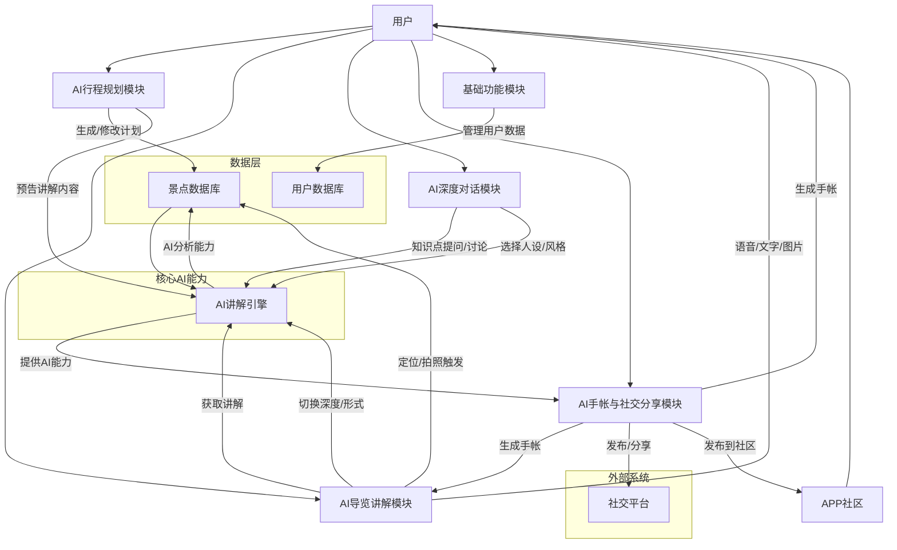
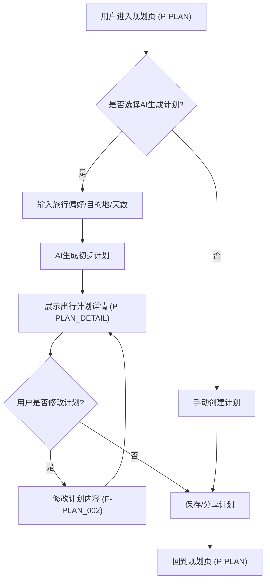
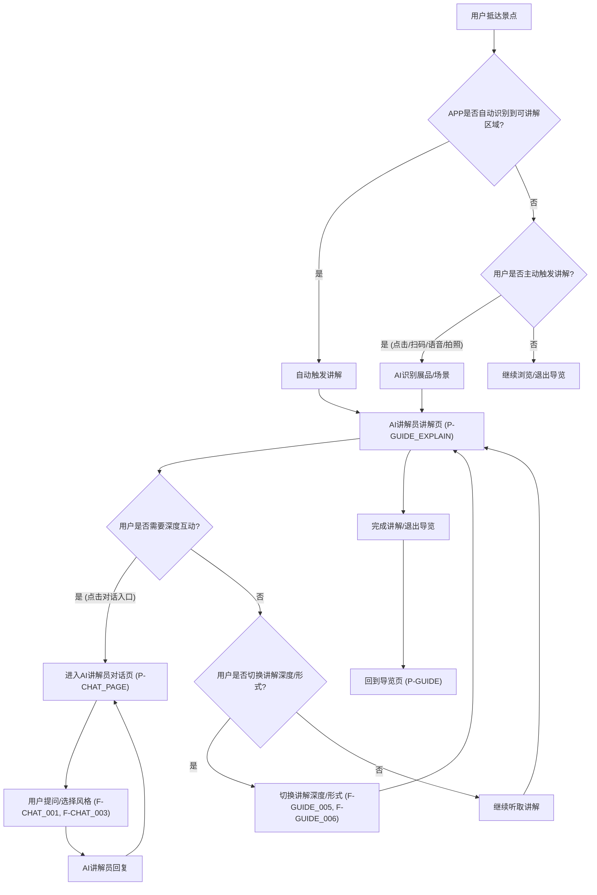
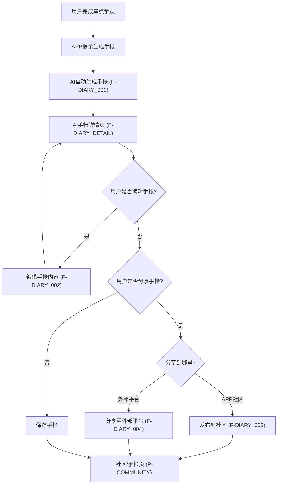
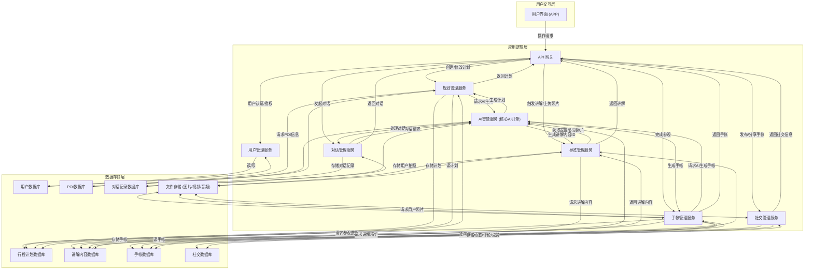

# 寻迹之旅产品需求文档

## 1. 产品概述

### 1.1 产品名称与定位

*   **产品名称:** 寻迹之旅
*   **产品定位:** 一款基于AI智能推荐与讲解的全球博物馆及景点导览移动应用工具。
*   **产品应用语言:** 多语言支持，初期默认中文，同时支持英文。

### 1.2 产品愿景与目标

*   **产品愿景:** 成为用户探索全球文化艺术、沉浸式体验历史的智能伴侣，让每一次旅行都充满深度与个性。
*   **产品目标:**
    *   提升用户在博物馆和景点参观中的体验，提供个性化、深度的AI讲解服务。
    *   简化用户旅行规划流程，通过AI生成智能行程计划。
    *   增强旅行的互动性和趣味性，提供AI讲解员深度对话功能。
    *   帮助用户记录和分享旅行回忆，通过AI自动生成手帐并支持社交分享。
    *   解决用户在自由行中遇到的语言障碍、信息获取不便、讲解缺乏等痛点。

### 1.3 产品使用终端

*   **移动端APP:** 支持iOS和Android操作系统。

### 1.4 核心价值主张

*   **AI驱动的个性化体验:** 基于用户兴趣、地理位置及现场照片，提供定制化的深度讲解与行程规划。
*   **全球范围的知识探索:** 支持用户在全球任意地点打卡参观，并获取多语言讲解。
*   **沉浸式互动学习:** 通过与AI讲解员深度对话，拓宽知识边界，解决疑问。
*   **便捷的旅行记录与分享:** 自动生成精美手帐，一键分享，留存美好回忆。

### 1.5 目标用户群体分析

*   **核心用户:**
    *   **文化艺术爱好者:** 追求深度知识和个性化讲解，对历史、艺术有浓厚兴趣。
    *   **自由行游客:** 习惯自主规划行程，但希望获得更专业的导览服务。
    *   **学生群体（K12/大学生）:** 渴望通过互动学习方式获取知识，用于课外实践或研学旅行。
    *   **家庭亲子用户:** 希望通过有趣的方式让孩子了解文化知识，提升亲子旅行体验。
    *   **数字科技尝鲜者:** 乐于体验和使用新兴AI技术产品。
*   **潜在用户:**
    *   **商务旅行者:** 在出差间隙希望快速高效地体验当地文化。

### 1.6 市场需求与竞品简析

*   **市场需求:**
    *   随着旅游消费升级，用户对旅行体验的要求不再局限于走马观花，更注重深度体验和个性化服务。
    *   传统导游服务成本高昂且难以个性化，语音导览器内容固化，缺乏互动性。
    *   年轻一代用户更习惯使用移动应用获取信息和规划行程。
    *   AI技术的普及为智能导览提供了新的可能性，用户对AI辅助旅行服务的接受度高。
*   **竞品简析:**
    *   **传统语音导览APP:** 如“故宫博物院”官方APP，提供固定讲解内容，缺乏互动和个性化。
    *   **旅行规划类APP:** 如“穷游”、“马蜂窝”，提供行程规划和攻略，但缺乏智能导览和深度讲解。
    *   **图片识别类APP:** 如“Google Lens”，可识别物体提供信息，但无法提供连贯的导览服务和深度对话。
    *   **AI对话类产品:** 如ChatGPT，具备强大的对话能力，但缺乏地理位置、图像识别与旅游场景的结合。
*   **寻迹之旅优势:**
    *   深度整合AI能力，提供个性化、多模态的讲解和对话。
    *   结合地理位置和多照片识别，实现更精准的讲解。
    *   AI自动生成行程计划和旅行手帐，覆盖行前、行中、行后全流程。
    *   强调互动和社交，解决自由行孤独感。

## 2. 功能规格

### 2.1 功能详述

### 2.1.1 AI行程规划模块

| 功能ID | 功能名称 | 功能描述 | 优先级 |
|--------|---------|---------|--------|
| F-PLAN_001 | 智能计划生成 | 用户输入目的地、旅行天数、兴趣偏好等信息后，AI自动生成包含景点推荐、顺序规划、预计行程时长、时间安排、AI讲解内容预告及餐饮住宿参考的详细出行计划。 | P0 |
| F-PLAN_002 | 计划内容修改 | 用户可在AI生成的计划基础上，对景点顺序、停留时间、餐饮住宿等内容进行修改、增删，支持拖拽调整。 | P0 |
| F-PLAN_003 | 计划跳过功能 | 用户可选择跳过AI计划生成步骤，直接进入手动规划或导览模式。 | P1 |
| F-PLAN_004 | 计划查看详情 | 展示出行计划的详细内容，包括路线地图与导航指引、景点列表与详细介绍、行程时间轴与预估时长、餐饮住宿推荐及预订入口、AI讲解内容预告或预览。 | P0 |
| F-PLAN_005 | 计划分享/导出 | 支持将生成的或修改后的出行计划分享给好友或导出为常见文件格式（如PDF、图片）。 | P1 |

### 2.1.2 AI导览讲解模块

| 功能ID | 功能名称 | 功能描述 | 优先级 |
|--------|---------|---------|--------|
| F-GUIDE_001 | 双重智能定位与切换 | APP采用双重定位策略（前台高精度超时+后台持续监测），智能识别用户当前地理位置。若前台定位超时（15秒），自动降级为手动选择模式，同时后台持续尝试定位，一旦成功自动无感切换至准确位置。 | P0 |
| F-GUIDE_002 | 照片组合讲解 | 用户拍摄展品或景点多张照片后，AI结合照片内容进行组合分析，提供定制化的讲解服务。 | P0 |
| F-GUIDE_003 | 语音讲解播放 | 提供多种音色可选的语音讲解，支持播放/暂停、快进/快退等控制，可在讲解界面内进行操作。 | P0 |
| F-GUIDE_004 | 文字/图片辅助讲解 | 讲解内容同步以文字形式展示，并配有相关辅助图片，支持用户阅读。 | P0 |
| F-GUIDE_005 | 讲解深度切换 | 用户可在讲解界面内通过明显按钮切换讲解深度，如“简介”、“深度解析”等。 | P0 |
| F-GUIDE_006 | 讲解形式切换 | 用户可在讲解界面内通过明显按钮切换讲解形式，如“故事性”、“知识性”等。 | P0 |
| F-GUIDE_007 | 主动讲解触发 | 用户可通过点击讲解按钮、扫描展品二维码/NFC标签、语音指令或拍摄照片等方式主动触发AI讲解。 | P0 |
| F-GUIDE_008 | 多语言讲解 | 根据用户设置，提供中文、英文等多语言的讲解服务。 | P0 |
| F-GUIDE_009 | 全球地点搜索 | 集成OpenStreetMap全球搜索服务，支持用户在手动模式下搜索全球任意博物馆/地标。若无匹配结果，支持创建通用导览模式。 | P0 |

### 2.1.3 AI深度对话模块

| 功能ID | 功能名称 | 功能描述 | 优先级 |
|--------|---------|---------|--------|
| F-CHAT_001 | 知识点提问 | 用户可针对AI讲解内容中的知识点向AI讲解员提问，获取更详细的解释。 | P0 |
| F-CHAT_002 | 多轮问答互动 | 支持与AI讲解员进行连续的多轮对话，深化对特定主题的理解。 | P0 |
| F-CHAT_003 | 讲解员风格选择 | 用户可选择不同的AI讲解员“人设”或风格（如幽默型、严谨型），提升互动体验。 | P1 |
| F-CHAT_004 | 反馈与建议 | 用户可向AI讲解员提供反馈或建议，用于优化讲解内容和互动体验。 | P1 |

### 2.1.4 AI手帐与社交分享模块

| 功能ID | 功能名称 | 功能描述 | 优先级 |
|--------|---------|---------|--------|
| F-DIARY_001 | 自动生成手帐 | 参观结束后，AI根据用户在行程中拍摄的照片/视频、AI讲解精华摘要、用户地理位置信息等自动生成旅行手帐。 | P0 |
| F-DIARY_002 | 手帐内容编辑 | 用户可对AI生成的手帐进行编辑，包括调整照片/视频、修改AI讲解摘要、添加或修改个人心得与笔记、增删推荐景点或展品信息。 | P0 |
| F-DIARY_003 | APP内动态发布 | 用户可将手帐发布到APP内的社区模块，作为个人动态，供其他用户浏览。 | P0 |
| F-DIARY_004 | 分享至外部平台 | 支持将手帐一键分享至微信、微博等外部社交平台。 | P0 |
| F-DIARY_005 | 点赞评论收藏 | 用户在社区模块中可对手帐进行点赞、评论和收藏操作。 | P0 |

### 2.1.5 基础功能模块

| 功能ID | 功能名称 | 功能描述 | 优先级 |
|--------|---------|---------|--------|
| F-BASE_001 | 用户注册/登录 | 支持手机号、第三方（微信、QQ等）注册登录，提供密码找回功能。 | P0 |
| F-BASE_002 | 个人信息管理 | 用户可设置头像、昵称、简介、修改密码等个人信息。 | P0 |
| F-BASE_003 | 偏好设置 | 用户可设置APP语言、通知偏好、AI讲解员默认风格等。 | P0 |
| F-BASE_004 | 全球景点库 | 维护一个全球范围内的景点和博物馆信息数据库，包含地理位置、介绍、开放时间等。 | P0 |
| F-BASE_005 | 搜索功能 | 提供全局搜索功能，用户可搜索景点、手帐、用户等内容。 | P1 |

### 2.2 功能模块间的关系图

## 3. 用户流程

### 3.1 用户旅程地图

**场景: 规划一次文化之旅并使用AI导览**

| 阶段 | 行为 | 痛点 | 机会点 | 期望体验 | 功能点 |
| :------------- | :------------------------------------ | :-------------------------------------- | :-------------------------------------- | :---------------------------------------------------------------------------------------------------- | :---------------------------------------------- |
| **行前准备** | 1. 产生旅行意向 | 不知去哪/看什么 | AI推荐景点 | 快速获取个性化景点推荐 | 首页推荐（P-HOME） |
| | 2. 制定出行计划 | 规划耗时/信息冗杂/缺乏专业建议 | AI智能生成计划/可编辑 | 轻松获得详细行程，并可根据需要修改 | 智能计划生成 (F-PLAN_001), 计划内容修改 (F-PLAN_002) |
| | 3. 查看计划详情 | 计划信息不全/难以理解 | 直观展示/讲解预告 | 清晰了解每日行程、交通、餐饮及讲解亮点 | 计划查看详情 (F-PLAN_004) |
| **行中体验** | 4. 抵达景点 | 不知从何开始参观/信息获取不便 | 定位识别/主动触发 | 到达景点即刻获得指引，快速进入导览状态 | 定位智能识别 (F-GUIDE_001), 主动讲解触发 (F-GUIDE_007) |
| | 5. 参观并获取讲解 | 讲解枯燥/语言障碍/缺乏深度/互动性差 | 多模态讲解/深度对话/多种形式/多语言 | 沉浸式体验，根据兴趣获得个性化、深度的语音或文字讲解，并能随时提问讨论 | 照片组合讲解 (F-GUIDE_002), 语音讲解播放 (F-GUIDE_003), 文字/图片辅助讲解 (F-GUIDE_004), 讲解深度切换 (F-GUIDE_005), 讲解形式切换 (F-GUIDE_006), 知识点提问 (F-CHAT_001), 多轮问答互动 (F-CHAT_002), 多语言讲解 (F-GUIDE_008) |
| **行后回顾** | 6. 回顾旅行 | 记录麻烦/容易遗忘/分享不便 | AI自动生成手帐/便捷分享 | 自动生成精美手帐，轻松记录点滴，方便分享给朋友 | 自动生成手帐 (F-DIARY_001), 手帐内容编辑 (F-DIARY_002), APP内动态发布 (F-DIARY_003), 分享至外部平台 (F-DIARY_004) |
| | 7. 与其他旅行者交流 | 缺乏分享平台/互动性差 | 社区互动功能 | 在社区中分享手帐，获得点赞评论，发现更多旅行灵感 | 点赞评论收藏 (F-DIARY_005) |

### 3.2 关键路径流程图

#### 3.2.1 AI行程规划与修改流程

#### 3.2.2 景点AI导览与深度对话流程

#### 3.2.3 AI手帐生成与社交分享流程

### 3.3 各场景下的用户操作步骤

#### 3.3.1 创建并修改出行计划

1.  用户进入 规划页（行程制定）（P-PLAN）。
2.  点击“AI智能生成计划”按钮。
3.  在 AI计划生成表单页（P-PLAN_GENERATE）中输入目的地、旅行天数、兴趣偏好等信息，点击“生成计划”。
4.  系统跳转至 出行计划详情页（P-PLAN_DETAIL），展示AI生成的计划。
5.  用户浏览计划内容，若需修改，点击“编辑”按钮。
6.  进入 行程计划编辑页（P-PLAN_EDIT），用户可拖拽调整景点顺序，修改停留时间，增删餐饮住宿推荐。
7.  点击“保存修改”按钮，更新后的计划显示在 出行计划详情页（P-PLAN_DETAIL）。
8.  用户可选择“分享”或“导出”该计划。

#### 3.3.2 使用AI讲解员进行导览

1.  用户进入 导览页（景点讲解）（P-GUIDE），并抵达某个景点。
2.  系统通过定位自动识别到用户进入可讲解区域，自动播放该区域的讲解内容，或用户点击“开始讲解”按钮。
3.  用户进入 AI讲解员讲解页（P-GUIDE_EXPLAIN）。
4.  在讲解过程中，用户可通过“拍照”按钮进入 拍照/相册选择页（P-CAMERA_UPLOAD）拍摄展品照片，AI将根据照片内容提供更精准的讲解。
5.  用户可点击界面上的“深度/形式切换”按钮，选择“深度解析”或“故事性”等不同讲解方式。
6.  若用户对某个知识点感兴趣，点击“对话”按钮，进入 AI讲解员对话页（P-CHAT_PAGE）。
7.  用户在对话框中输入问题，AI讲解员进行回复，支持多轮问答。
8.  用户可在对话页中点击“选择讲解员风格”入口调起 讲解员风格选择弹窗（P-AI_STYLE_SELECTOR），选择AI讲解员的“人设”或风格。
9.  完成对话后，用户可返回 AI讲解员讲解页（P-GUIDE_EXPLAIN）继续听取讲解。

#### 3.3.3 生成并分享旅行手帐

1.  用户完成景点参观后，APP自动在后台生成旅行手帐，并弹出提示。
2.  用户点击提示或进入 社区/手帐页（分享互动）（P-COMMUNITY）选择“我的手帐”，查看 AI手帐详情页（P-DIARY_DETAIL）。
3.  用户浏览手帐内容，若需编辑，点击“编辑”按钮。
4.  进入 手帐编辑页（P-DIARY_EDIT），用户可调整照片/视频顺序、修改AI讲解摘要、添加个人心得笔记等。
5.  编辑完成后，点击“保存”按钮，更新手帐内容。
6.  用户点击“分享”按钮，调起 分享弹窗（P-SHARE_POPUP），可选择“发布到社区”或“分享至微信/微博”等外部平台。
7.  若发布到社区，手帐将显示在 社区/手帐页（分享互动）（P-COMMUNITY）的动态列表中，其他用户可进行点赞、评论和收藏。

## 4. 数据流设计

### 4.1 数据结构与关系

| 数据实体 | 字段 | 类型 | 描述 | 关系 |
| :----------- | :--------------------- | :----------- | :--------------------------------------- | :-------------------------------------------------------------------- |
| **用户 (User)** | UserID | String (PK) | 用户唯一标识 | 1:N 计划, 1:N 手帐, 1:N 评论, 1:N 点赞, 1:N 收藏 |
| | | Nickname | String | 昵称 | |
| | | Bio | Text | 个人简介 | |
| | Email/Phone | String | 注册邮箱/手机号 | |
| | PasswordHash | String | 密码哈希值 | |
| | AvatarURL | String | 头像图片URL | |
| | Language | String | APP语言设置 (zh-CN, en-US等) | |
| | PreferredAIAttribute | String | 偏好的AI讲解员风格 | |
| | CreatedAt | Timestamp | 注册时间 | |
| **景点 (POI)** | POIID | String (PK) | 景点唯一标识 | 1:N AI讲解内容 |
| | Name | String | 景点名称 | |
| | Description | Text | 景点介绍 | |
| | Location | GeoJSON | 地理位置信息 (经纬度) | |
| | Address | String | 详细地址 | |
| | OpeningHours | JSON | 开放时间 | |
| | ImageURLs | Array<String> | 景点图片URL列表 | |
| | Category | String | 景点类别 (博物馆, 历史遗迹等) | |
| **行程计划 (Itinerary)** | ItineraryID | String (PK) | 行程计划唯一标识 | N:1 用户, N:M POI |
| | UserID | String (FK) | 所属用户ID | |
| | PlanName | String | 计划名称 | |
| | Destination | String | 目的地 | |
| | StartDate | Date | 开始日期 | |
| | EndDate | Date | 结束日期 | |
| | Days | Array<JSON> | 每日行程详情 (包含景点列表, 顺序, 预计时长, 餐饮住宿等) | |
| | AIExplanationPreview | Text | AI讲解内容预告 | |
| | CreatedAt | Timestamp | 创建时间 | |
| **AI讲解内容 (AIExplanation)** | ExplanationID | String (PK) | 讲解内容唯一标识 | N:1 POI |
| | POIID | String (FK) | 所属景点ID | |
| | Language | String | 讲解语言 | |
| | Depth | Enum | 讲解深度 (简介, 深度解析) | |
| | Format | Enum | 讲解形式 (故事性, 知识性) | |
| | AudioURL | String | 语音讲解文件URL | |
| | TextContent | Text | 文字讲解内容 | |
| | ImageURLs | Array<String> | 辅助图片URL列表 | |
| **AI对话记录 (AIChatHistory)** | ChatID | String (PK) | 对话记录唯一标识 | N:1 用户, N:1 AI讲解内容 (关联上下文) |
| | UserID | String (FK) | 对话用户ID | |
| | ExplanationID | String (FK) | 关联的讲解ID | |
| | ChatContext | Array<JSON> | 对话历史 (用户提问, AI回复) | |
| | AIAttributeUsed | String | 使用的AI讲解员风格 | |
| | Timestamp | Timestamp | 对话时间 | |
| **旅行手帐 (Travelogue)** | TravelogueID | String (PK) | 手帐唯一标识 | N:1 用户, N:M POI |
| | UserID | String (FK) | 所属用户ID | |
| | Title | String | 手帐标题 (AI生成或用户自定义) | |
| | Content | Array<JSON> | 手帐内容 (照片/视频, AI讲解摘要, 用户笔记, 推荐信息) | |
| | POIIDs | Array<String> | 关联景点ID列表 | |
| | CreatedAt | Timestamp | 生成时间 | |
| | LastEditedAt | Timestamp | 最后编辑时间 | |
| **社交动态 (SocialPost)** | PostID | String (PK) | 动态唯一标识 | N:1 用户, N:1 旅行手帐 |
| | UserID | String (FK) | 发布用户ID | |
| | TravelogueID | String (FK) | 关联手帐ID | |
| | Content | Text | 动态文字内容 | |
| | ImageVideoURLs | Array<String> | 动态图片/视频URL列表 | |
| | LikesCount | Integer | 点赞数 | |
| | CommentsCount | Integer | 评论数 | |
| | CreatedAt | Timestamp | 发布时间 | |
| **评论 (Comment)** | CommentID | String (PK) | 评论唯一标识 | N:1 用户, N:1 社交动态 |
| | PostID | String (FK) | 所属动态ID | |
| | UserID | String (FK) | 评论用户ID | |
| | Content | Text | 评论内容 | |
| | CreatedAt | Timestamp | 评论时间 | |
| **点赞 (Like)** | LikeID | String (PK) | 点赞唯一标识 | N:1 用户, N:1 社交动态 |
| | PostID | String (FK) | 所属动态ID | |
| | UserID | String (FK) | 点赞用户ID | |
| | CreatedAt | Timestamp | 点赞时间 | |
| **收藏 (Favorite)** | FavoriteID | String (PK) | 收藏唯一标识 | N:1 用户, N:1 社交动态 或 N:1 旅行手帐 |
| | UserID | String (FK) | 收藏用户ID | |
| | TargetType | Enum | 收藏目标类型 (Post, Travelogue) | |
| | TargetID | String (FK) | 收藏目标ID | |
| | CreatedAt | Timestamp | 收藏时间 | |

### 4.2 关键数据流向图

### 4.3 数据存储与处理原则

*   **数据安全:** 用户个人信息、行程计划、手帐内容等敏感数据进行加密存储和传输，遵循最小权限原则。
*   **隐私保护:** 严格遵守数据隐私法规，确保用户数据仅用于提供服务，未经授权不得泄露。
*   **可扩展性:** 数据库设计考虑未来数据量的增长和功能扩展，采用分布式存储和高可用架构。
*   **数据一致性:** 确保多服务间数据操作的一致性，采用事务管理和消息队列等机制。
*   **AI数据处理:** AI模型训练数据进行脱敏处理，用户上传的图片和对话内容用于优化AI服务，但不会泄露个人信息。
*   **多语言支持:** 所有文本数据字段均支持多语言存储和检索，以适应全球用户需求。

## 5. 页面规格

### 5.1 页面概览

| 页面ID | 页面名称 | 核心功能 |
| :--------------- | :----------------------- | :------------------------------------------- |
| P-LOGIN | 登录/注册页 | 用户身份验证 |
| P-HOME | 首页（推荐/发现） | 景点推荐、最新动态、功能入口 |
| P-PLAN | 规划页（行程制定） | AI智能行程规划与管理 |
| P-PLAN_DETAIL | 出行计划详情页 | 展示AI生成的或用户修改后的详细行程 |
| P-PLAN_EDIT | 行程计划编辑页 | 用户修改行程计划的具体内容 |
| P-GUIDE | 导览页（景点讲解） | 实时定位、景点列表、讲解触发 |
| P-GUIDE_EXPLAIN | AI讲解员讲解页 | AI语音/文字讲解、深度/形式切换、拍照识别 |
| P-CHAT_PAGE | AI讲解员对话页 | 与AI讲解员进行深度对话 |
| P-COMMUNITY | 社区/手帐页（分享互动） | 用户手帐动态、社交互动 |
| P-DIARY_DETAIL | AI手帐详情页 | 展示AI生成或用户编辑后的手帐内容 |
| P-DIARY_EDIT | 手帐编辑页 | 用户编辑手帐内容 |
| P-PROFILE | 我的页（个人中心） | 个人信息管理、设置、我的手帐、我的计划 |
| P-PROFILE_EDIT | 个人信息编辑页 | 编辑用户头像、昵称、简介等个人资料 |
| P-SETTINGS | 设置页 | 应用通用设置，如语言、通知、AI风格等 |
| P-POI_DETAIL | 景点详情页 | 景点信息展示、快速导览入口 |
| P-CAMERA_UPLOAD | 拍照/相册选择页 | 唤起相机或相册 |
| P-SHARE_POPUP | 分享弹窗 | 分享渠道选择 |
| P-FORGOT_PASSWORD | 密码找回页 | 验证身份、重置密码 |
| P-PLAN_GENERATE | AI计划生成表单页 | 用户偏好信息输入 |
| P-MY_DIARIES | 我的手帐列表页 | 手帐列表展示、快速查看、编辑、删除 |
| P-MY_PLANS | 我的计划列表页 | 行程计划列表展示、快速查看、编辑、删除 |
| P-MY_FAVORITES | 我的收藏列表页 | 收藏内容展示、快速查看、取消收藏 |
| P-SEARCH_RESULT | 搜索结果页 | 搜索结果展示、筛选、排序 |
| P-POI_SELECTOR | 景点选择页 | 景点搜索、筛选、选择 |
| P-SCANNER | 扫码/NFC页面 | 唤起相机进行扫码识别，或等待NFC标签感应 |
| P-VOICE_INPUT | 语音识别界面 | 语音转文本、语音指令识别 |
| P-AI_STYLE_SELECTOR | 讲解员风格选择弹窗 | 提供风格选项、记录用户偏好 |
| P-LANGUAGE_SELECTOR | 语言选择弹窗 | 提供语言选项、切换应用语言 |
| P-COMMENT_LIST | 评论列表/输入框 | 评论的查看、发布 |

### 5.2 页面详情

#### 5.2.1 登录/注册页（P-LOGIN）

*   **页面名称与目的:** 登录/注册页（P-LOGIN），用于新用户注册和老用户登录，确保用户身份。
*   **页面负责的核心功能:** 用户身份认证、账号创建、密码找回。
*   **主要UI元素与布局建议:**
    *   顶部Logo及应用名称。
    *   登录/注册切换Tab或按钮。
    *   手机号/邮箱输入框、密码输入框。
    *   验证码输入框（注册/找回密码时显示）。
    *   第三方登录按钮（微信、Apple ID等）。
    *   “忘记密码”链接。
    *   “登录”/“注册”按钮。
*   **页面需展示的关键数据:** 用户输入的手机号/邮箱、密码。
*   **交互方式说明:**
    *   点击输入框调起键盘。
    *   点击“登录”/“注册”按钮提交表单。
    *   点击第三方登录按钮跳转至对应平台授权。
    *   点击“忘记密码”进入密码找回流程。
*   **页面间跳转关系:**

| 页面 | 触发组件 | 交互类型 | 目标页面 | 传递参数 |
| :-------------------- | :--------------- | :------- | :----------------------------- | :------------ |
| 登录/注册页（P-LOGIN） | 登录/注册成功 | 自动跳转 | 首页（推荐/发现）（P-HOME） | UserToken |
| 登录/注册页（P-LOGIN） | 忘记密码链接 | 点击 | 密码找回页（P-FORGOT_PASSWORD） | 无 |
| 密码找回页（P-FORGOT_PASSWORD） | 找回成功后返回 | 自动跳转 | 登录/注册页（P-LOGIN） | 无 |

#### 5.2.2 首页（推荐/发现）（P-HOME）

*   **页面名称与目的:** 首页（推荐/发现）（P-HOME），向用户展示个性化推荐内容、最新活动和核心功能入口。
*   **页面负责的核心功能:** 内容发现、快速进入其他功能模块。
*   **主要UI元素与布局建议:**
    *   顶部搜索栏及消息通知入口。
    *   轮播图（推荐热门景点、活动）。
    *   快速功能入口（如：AI规划、开始导览、社区）。
    *   个性化景点推荐列表（瀑布流或卡片式）。
    *   最新用户手帐/动态预览。
    *   底部导航栏（首页、规划、导览、社区、我的）。
*   **页面需展示的关键数据:** 推荐景点信息、活动信息、用户动态摘要。
*   **交互方式说明:**
    *   点击轮播图、推荐景点卡片进入 景点详情页（P-POI_DETAIL）。
    *   点击快速功能入口跳转对应页面。
    *   点击底部导航栏切换一级页面。
    *   下拉刷新页面内容。
*   **页面间跳转关系:**

| 页面 | 触发组件 | 交互类型 | 目标页面 | 传递参数 |
| :------------------- | :------------------- | :------- | :-------------------------------- | :------------ |
| 首页（推荐/发现）（P-HOME） | 快速入口“AI规划” | 点击 | 规划页（行程制定）（P-PLAN） | 无 |
| 首页（推荐/发现）（P-HOME） | 快速入口“开始导览” | 点击 | 导览页（景点讲解）（P-GUIDE） | 无 |
| 首页（推荐/发现）（P-HOME） | 快速入口“社区” | 点击 | 社区/手帐页（分享互动）（P-COMMUNITY） | 无 |
| 首页（推荐/发现）（P-HOME） | 推荐景点卡片 | 点击 | 景点详情页（P-POI_DETAIL） | POIID |
| 首页（推荐/发现）（P-HOME） | 用户动态预览 | 点击 | AI手帐详情页（P-DIARY_DETAIL） | TravelogueID |
| 首页（推荐/发现）（P-HOME） | 底部导航“规划” | 点击 | 规划页（行程制定）（P-PLAN） | 无 |
| 首页（推荐/发现）（P-HOME） | 底部导航“导览” | 点击 | 导览页（景点讲解）（P-GUIDE） | 无 |
| 首页（推荐/发现）（P-HOME） | 底部导航“社区” | 点击 | 社区/手帐页（分享互动）（P-COMMUNITY） | 无 |
| 首页（推荐/发现）（P-HOME） | 底部导航“我的” | 点击 | 我的页（个人中心）（P-PROFILE） | 无 |
| 首页（推荐/发现）（P-HOME） | 搜索图标 | 点击 | 搜索结果页（P-SEARCH_RESULT） | 无 |

#### 5.2.3 规划页（行程制定）（P-PLAN）

*   **页面名称与目的:** 规划页（行程制定）（P-PLAN），供用户制定和管理旅行计划。
*   **页面负责的核心功能:** AI智能计划生成、手动计划创建、计划列表管理。
*   **主要UI元素与布局建议:**
    *   顶部“AI智能生成计划”按钮。
    *   “手动创建计划”按钮。
    *   我的计划列表（卡片式，显示计划名称、目的地、日期、状态）。
    *   底部导航栏。
*   **页面需展示的关键数据:** 我的行程计划列表。
*   **交互方式说明:**
    *   点击“AI智能生成计划”进入AI计划生成流程。
    *   点击“手动创建计划”进入手动创建页面。
    *   点击计划列表中的卡片进入 出行计划详情页（P-PLAN_DETAIL）。
*   **页面间跳转关系:**

| 页面 | 触发组件 | 交互类型 | 目标页面 | 传递参数 |
| :------------------- | :------------------- | :------- | :-------------------------------- | :------------ |
| 规划页（行程制定）（P-PLAN） | AI智能生成计划按钮 | 点击 | AI计划生成表单页（P-PLAN_GENERATE） | 无 |
| 规划页（行程制定）（P-PLAN） | 手动创建计划按钮 | 点击 | 行程计划编辑页（P-PLAN_EDIT） | Type="New" |
| 规划页（行程制定）（P-PLAN） | 计划列表项 | 点击 | 出行计划详情页（P-PLAN_DETAIL） | ItineraryID |
| 规划页（行程制定）（P-PLAN） | 底部导航“首页” | 点击 | 首页（推荐/发现）（P-HOME） | 无 |
| 规划页（行程制定）（P-PLAN） | 底部导航“导览” | 点击 | 导览页（景点讲解）（P-GUIDE） | 无 |
| 规划页（行程制定）（P-PLAN） | 底部导航“社区” | 点击 | 社区/手帐页（分享互动）（P-COMMUNITY） | 无 |
| 规划页（行程制定）（P-PLAN） | 底部导航“我的” | 点击 | 我的页（个人中心）（P-PROFILE） | 无 |

#### 5.2.4 出行计划详情页（P-PLAN_DETAIL）

*   **页面名称与目的:** 出行计划详情页（P-PLAN_DETAIL），展示AI生成或用户修改后的完整行程计划。
*   **页面负责的核心功能:** 查看详细行程、修改计划、分享计划。
*   **主要UI元素与布局建议:**
    *   顶部返回按钮和“分享”、“编辑”按钮。
    *   计划名称、目的地、日期等概览信息。
    *   路线地图与导航指引模块。
    *   每日行程时间轴，显示景点列表、预计时长、餐饮住宿推荐。
    *   景点列表与详细介绍（可点击展开）。
    *   AI讲解内容预告或预览。
    *   底部“开始导览”按钮。
*   **页面需展示的关键数据:** 完整的行程计划数据，包括POI信息、时间、交通、餐饮住宿、AI讲解预告。
*   **交互方式说明:**
    *   点击“编辑”按钮进入 行程计划编辑页（P-PLAN_EDIT）。
    *   点击“分享”按钮调起 分享弹窗（P-SHARE_POPUP）。
    *   点击景点列表项进入 景点详情页（P-POI_DETAIL）。
    *   点击“开始导览”按钮进入 导览页（景点讲解）（P-GUIDE）。
*   **页面间跳转关系:**

| 页面 | 触发组件 | 交互类型 | 目标页面 | 传递参数 |
| :------------------------- | :--------------- | :------- | :-------------------------------- | :------------ |
| 出行计划详情页（P-PLAN_DETAIL） | 编辑按钮 | 点击 | 行程计划编辑页（P-PLAN_EDIT） | ItineraryID |
| 出行计划详情页（P-PLAN_DETAIL） | 分享按钮 | 点击 | 分享弹窗（P-SHARE_POPUP） | ItineraryID |
| 出行计划详情页（P-PLAN_DETAIL） | 景点列表项 | 点击 | 景点详情页（P-POI_DETAIL） | POIID |
| 出行计划详情页（P-PLAN_DETAIL） | 开始导览按钮 | 点击 | 导览页（景点讲解）（P-GUIDE） | ItineraryID |
| 出行计划详情页（P-PLAN_DETAIL） | 返回按钮 | 点击 | 规划页（行程制定）（P-PLAN） | 无 |

#### 5.2.5 行程计划编辑页（P-PLAN_EDIT）

*   **页面名称与目的:** 行程计划编辑页（P-PLAN_EDIT），供用户手动创建或修改行程计划。
*   **页面负责的核心功能:** 行程计划内容的增删改查。
*   **主要UI元素与布局建议:**
    *   顶部返回按钮和“保存”按钮。
    *   计划名称、目的地、日期输入框。
    *   每日行程列表，支持添加、删除、拖拽排序景点。
    *   景点选择器（可搜索POI并添加到计划）。
    *   餐饮住宿添加/修改模块。
*   **页面需展示的关键数据:** 当前编辑的行程计划所有信息。
*   **交互方式说明:**
    *   点击输入框进行内容编辑。
    *   点击“添加景点”按钮调起 景点选择页（P-POI_SELECTOR）。
    *   点击景点卡片进行编辑或删除。
    *   点击“保存”按钮保存修改并返回。
*   **页面间跳转关系:**

| 页面 | 触发组件 | 交互类型 | 目标页面 | 传递参数 |
| :----------------------- | :--------------- | :------- | :-------------------------------- | :---------- |
| 行程计划编辑页（P-PLAN_EDIT） | 保存按钮 | 点击 | 出行计划详情页（P-PLAN_DETAIL） | ItineraryID |
| 行程计划编辑页（P-PLAN_EDIT） | 返回按钮 | 点击 | 出行计划详情页（P-PLAN_DETAIL） | ItineraryID |
| 行程计划编辑页（P-PLAN_EDIT） | 添加景点 | 点击 | 景点选择页（P-POI_SELECTOR） | 无 |

#### 5.2.6 导览页（景点讲解）（P-GUIDE）

*   **页面名称与目的:** 导览页（景点讲解）（P-GUIDE），用户在景点现场的核心操作页面，用于触发和管理讲解。采用沉浸式全屏设计。
*   **页面负责的核心功能:** 双重智能定位、全球地点搜索、景点/展品列表、讲解触发。
*   **主要UI元素与布局建议:**
    *   **沉浸式全屏地图**（隐藏底部导航栏）。
    *   **定位中遮罩层**：包含定位动画、提示语（"定位中，预计需要 5-15 秒"）及“跳过，手动选择”按钮。
    *   **手动选择/搜索层**（定位失败/跳过时显示）：包含**全球搜索框**（支持OSM搜索）、附近热门景点列表、自定义导览入口。
    *   **顶部Context Bar**（定位成功后显示）：当前景点名称/位置信息、切换位置下拉入口。
    *   **地图视图**：Leaflet/Mapbox 渲染，显示用户位置及周边展品。
    *   **交互按钮组**：“扫描”、“拍照识别”、“语音指令”。
*   **页面需展示的关键数据:** 当前位置、搜索结果（含距离）、附近景点/展品信息。
*   **交互方式说明:**
    *   **进入页面**：立即启动前台高精度定位（15秒超时）。
    *   **定位中**：用户可点击“跳过”直接进入手动选择层；后台持续尝试定位。
    *   **手动选择**：用户输入关键词搜索全球景点，点击列表项切换位置；或若后台定位成功，系统自动无感切换至准确位置并提示。
    *   **导览模式**：点击景点/展品卡片进入 AI讲解员讲解页（P-GUIDE_EXPLAIN）。
*   **页面间跳转关系:**

| 页面 | 触发组件 | 交互类型 | 目标页面 | 传递参数 |
| :----------------------- | :------------------- | :------- | :-------------------------------- | :------------ |
| 导览页（景点讲解）（P-GUIDE） | 景点/展品列表项 | 点击 | AI讲解员讲解页（P-GUIDE_EXPLAIN） | POIID |
| 导览页（景点讲解）（P-GUIDE） | 扫描按钮 | 点击 | 扫码/NFC页面（P-SCANNER） | 无 |
| 导览页（景点讲解）（P-GUIDE） | 拍照识别按钮 | 点击 | 拍照/相册选择页（P-CAMERA_UPLOAD） | Type="Recognize" |
| 导览页（景点讲解）（P-GUIDE） | 语音指令入口 | 点击 | 语音识别界面（P-VOICE_INPUT） | 无 |
| 导览页（景点讲解）（P-GUIDE） | 自动触发 | 自动跳转 | AI讲解员讲解页（P-GUIDE_EXPLAIN） | POIID |
| 导览页（景点讲解）（P-GUIDE） | 物理返回/关闭 | 点击 | 首页（推荐/发现）（P-HOME） | 无 |

#### 5.2.7 AI讲解员讲解页（P-GUIDE_EXPLAIN）

*   **页面名称与目的:** AI讲解员讲解页（P-GUIDE_EXPLAIN），展示AI讲解内容并提供互动操作。
*   **页面负责的核心功能:** 播放讲解、切换讲解深度/形式、与AI对话入口、拍照/上传图片。
*   **主要UI元素与布局建议:**
    *   顶部返回按钮和当前景点/展品名称。
    *   当前景点/展品图片或视频展示区域。
    *   讲解内容文本显示区域。
    *   语音讲解进度控制条（播放/暂停、快进/快退、音量控制）。
    *   “深度/形式切换”按钮组（简介/深度解析、故事性/知识性）。
    *   “与AI讲解员对话”入口按钮。
    *   “拍照/上传图片”按钮。
*   **页面需展示的关键数据:** AI讲解文本、语音、图片/视频，当前讲解深度和形式。
*   **交互方式说明:**
    *   点击播放/暂停、快进/快退按钮控制语音播放。
    *   点击“深度/形式切换”按钮即时切换讲解模式。
    *   点击“与AI讲解员对话”按钮进入 AI讲解员对话页（P-CHAT_PAGE）。
    *   点击“拍照/上传图片”按钮进入 拍照/相册选择页（P-CAMERA_UPLOAD）调起相机或相册。
*   **页面间跳转关系:**

| 页面 | 触发组件 | 交互类型 | 目标页面 | 传递参数 |
| :------------------------- | :------------------- | :------- | :-------------------------------- | :------------ |
| AI讲解员讲解页（P-GUIDE_EXPLAIN） | 与AI讲解员对话按钮 | 点击 | AI讲解员对话页（P-CHAT_PAGE） | POIID, ExplanationID |
| AI讲解员讲解页（P-GUIDE_EXPLAIN） | 拍照/上传图片按钮 | 点击 | 拍照/相册选择页（P-CAMERA_UPLOAD） | POIID |
| AI讲解员讲解页（P-GUIDE_EXPLAIN） | 返回按钮 | 点击 | 导览页（景点讲解）（P-GUIDE） | 无 |

#### 5.2.8 AI讲解员对话页（P-CHAT_PAGE）

*   **页面名称与目的:** AI讲解员对话页（P-CHAT_PAGE），提供用户与AI讲解员进行深度知识交流的界面。
*   **页面负责的核心功能:** 与AI讲解员多轮对话、选择讲解员风格。
*   **主要UI元素与布局建议:**
    *   顶部返回按钮和AI讲解员名称。
    *   对话历史记录显示区域（气泡式）。
    *   底部输入框和发送按钮。
    *   “选择讲解员风格”入口（如按钮或弹窗）。
*   **页面需展示的关键数据:** 对话历史记录、当前AI讲解员风格。
*   **交互方式说明:**
    *   在输入框输入问题，点击发送按钮提交。
    *   点击“选择讲解员风格”入口调起 讲解员风格选择弹窗（P-AI_STYLE_SELECTOR）。
    *   滚动查看对话历史。
*   **页面间跳转关系:**

| 页面 | 触发组件 | 交互类型 | 目标页面 | 传递参数 |
| :------------------------- | :------------------- | :------- | :-------------------------------- | :---------- |
| AI讲解员对话页（P-CHAT_PAGE） | 返回按钮 | 点击 | AI讲解员讲解页（P-GUIDE_EXPLAIN） | 无 |
| AI讲解员对话页（P-CHAT_PAGE） | 选择讲解员风格入口 | 点击 | 讲解员风格选择弹窗（P-AI_STYLE_SELECTOR） | 无 |

#### 5.2.9 社区/手帐页（分享互动）（P-COMMUNITY）

*   **页面名称与目的:** 社区/手帐页（分享互动）（P-COMMUNITY），展示用户发布的旅行手帐动态，并提供社交互动功能。
*   **页面负责的核心功能:** 手帐动态浏览、点赞评论收藏、发布入口。
*   **主要UI元素与布局建议:**
    *   顶部“我的手帐”入口和“发布”按钮。
    *   手帐动态信息流（瀑布流或列表），显示手帐封面、标题、发布者、点赞评论数。
    *   底部导航栏。
*   **页面需展示的关键数据:** 其他用户或关注用户发布的手帐动态。
*   **交互方式说明:**
    *   点击手帐动态进入 AI手帐详情页（P-DIARY_DETAIL）。
    *   点击点赞/评论/收藏图标进行互动。
    *   点击“我的手帐”进入 我的手帐列表页（P-MY_DIARIES）。
    *   点击“发布”按钮进入 手帐编辑页（P-DIARY_EDIT）进行手帐发布。
*   **页面间跳转关系:**

| 页面 | 触发组件 | 交互类型 | 目标页面 | 传递参数 |
| :------------------------- | :------------------- | :------- | :-------------------------------- | :------------ |
| 社区/手帐页（分享互动）（P-COMMUNITY） | 手帐动态列表项 | 点击 | AI手帐详情页（P-DIARY_DETAIL） | TravelogueID |
| 社区/手帐页（分享互动）（P-COMMUNITY） | 我的手帐入口 | 点击 | 我的手帐列表页（P-MY_DIARIES） | UserID, Tab="MyDiaries" |
| 社区/手帐页（分享互动）（P-COMMUNITY） | 发布按钮 | 点击 | 手帐编辑页（P-DIARY_EDIT） | Type="New" |
| 社区/手帐页（分享互动）（P-COMMUNITY） | 底部导航“首页” | 点击 | 首页（推荐/发现）（P-HOME） | 无 |
| 社区/手帐页（分享互动）（P-COMMUNITY） | 底部导航“规划” | 点击 | 规划页（行程制定）（P-PLAN） | 无 |
| 社区/手帐页（分享互动）（P-COMMUNITY） | 底部导航“导览” | 点击 | 导览页（景点讲解）（P-GUIDE） | 无 |
| 社区/手帐页（分享互动）（P-COMMUNITY） | 底部导航“我的” | 点击 | 我的页（个人中心）（P-PROFILE） | 无 |

#### 5.2.10 AI手帐详情页（P-DIARY_DETAIL）

*   **页面名称与目的:** AI手帐详情页（P-DIARY_DETAIL），展示AI生成或用户编辑后的完整旅行手帐内容。
*   **页面负责的核心功能:** 浏览手帐、编辑、分享、评论。
*   **主要UI元素与布局建议:**
    *   顶部返回按钮和“分享”、“编辑”按钮。
    *   手帐顶部照片/视频集（可滑动查看）。
    *   AI讲解精华摘要。
    *   用户个人心得与笔记。
    *   推荐景点或展品信息。
    *   点赞、评论、收藏按钮。
    *   评论列表。
*   **页面需展示的关键数据:** 完整的旅行手帐内容，包括图片、视频、AI摘要、用户笔记、评论等。
*   **交互方式说明:**
    *   滑动查看照片/视频。
    *   点击“编辑”按钮进入 手帐编辑页（P-DIARY_EDIT）。
    *   点击“分享”按钮调起 分享弹窗（P-SHARE_POPUP）。
    *   点击点赞/收藏按钮进行操作。
    *   点击评论区域或图标进入 评论列表/输入框（P-COMMENT_LIST）查看/发布评论。
*   **页面间跳转关系:**

| 页面 | 触发组件 | 交互类型 | 目标页面 | 传递参数 |
| :------------------------- | :------------------- | :------- | :-------------------------------- | :------------ |
| AI手帐详情页（P-DIARY_DETAIL） | 编辑按钮 | 点击 | 手帐编辑页（P-DIARY_EDIT） | TravelogueID |
| AI手帐详情页（P-DIARY_DETAIL） | 分享按钮 | 点击 | 分享弹窗（P-SHARE_POPUP） | TravelogueID |
| AI手帐详情页（P-DIARY_DETAIL） | 评论按钮/区域 | 点击 | 评论列表/输入框（P-COMMENT_LIST） | PostID/TravelogueID |
| AI手帐详情页（P-DIARY_DETAIL） | 返回按钮 | 点击 | 社区/手帐页（分享互动）（P-COMMUNITY） | 无 |

#### 5.2.11 手帐编辑页（P-DIARY_EDIT）

*   **页面名称与目的:** 手帐编辑页（P-DIARY_EDIT），供用户修改或创建手帐内容。
*   **页面负责的核心功能:** 手帐内容的增删改查、图片/视频管理。
*   **主要UI元素与布局建议:**
    *   顶部返回按钮和“保存/发布”按钮。
    *   手帐标题输入框。
    *   照片/视频上传及管理区域（支持拖拽排序、删除）。
    *   AI讲解精华摘要编辑框。
    *   用户个人心得与笔记编辑框。
    *   推荐景点或展品信息添加/编辑模块。
*   **页面需展示的关键数据:** 当前编辑的手帐所有内容。
*   **交互方式说明:**
    *   点击输入框进行内容编辑。
    *   点击“添加图片/视频”按钮调起 拍照/相册选择页（P-CAMERA_UPLOAD）。
    *   点击“保存/发布”按钮提交手帐。
*   **页面间跳转关系:**

| 页面 | 触发组件 | 交互类型 | 目标页面 | 传递参数 |
| :--------------------- | :--------------- | :------- | :------------------------------ | :------------ |
| 手帐编辑页（P-DIARY_EDIT） | 保存/发布按钮 | 点击 | AI手帐详情页（P-DIARY_DETAIL） | TravelogueID |
| 手帐编辑页（P-DIARY_EDIT） | 返回按钮 | 点击 | AI手帐详情页（P-DIARY_DETAIL） | TravelogueID |
| 手帐编辑页（P-DIARY_EDIT） | 添加图片/视频 | 点击 | 拍照/相册选择页（P-CAMERA_UPLOAD） | Type="Diary" |

#### 5.2.12 我的页（个人中心）（P-PROFILE）

*   **页面名称与目的:** 我的页（个人中心）（P-PROFILE），展示用户个人信息并提供各项设置和内容管理入口。
*   **页面负责的核心功能:** 个人信息管理、应用设置、我的手帐、我的计划、我的收藏等。
*   **主要UI元素与布局建议:**
    *   顶部用户头像、昵称、UID。
    *   “我的手帐”、“我的计划”、“我的收藏”、“我的消息”等功能入口列表。
    *   “设置”入口。
    *   底部导航栏。
*   **页面需展示的关键数据:** 用户头像、昵称、已发布手帐数量、已创建计划数量、收藏数量。
*   **交互方式说明:**
    *   点击头像/昵称进入个人信息编辑页（P-PROFILE_EDIT）。
    *   点击“我的手帐”入口进入 我的手帐列表页（P-MY_DIARIES）。
    *   点击“我的计划”入口进入 我的计划列表页（P-MY_PLANS）。
    *   点击“我的收藏”入口进入 我的收藏列表页（P-MY_FAVORITES）。
    *   点击“设置”入口进入 设置页（P-SETTINGS）。
*   **页面间跳转关系:**

| 页面 | 触发组件 | 交互类型 | 目标页面 | 传递参数 |
| :------------------------- | :------------------- | :------- | :-------------------------------- | :------------ |
| 我的页（个人中心）（P-PROFILE） | 头像/昵称区域 | 点击 | 个人信息编辑页（P-PROFILE_EDIT） | UserID |
| 我的页（个人中心）（P-PROFILE） | 我的手帐入口 | 点击 | 我的手帐列表页（P-MY_DIARIES） | UserID |
| 我的页（个人中心）（P-PROFILE） | 我的计划入口 | 点击 | 我的计划列表页（P-MY_PLANS） | UserID |
| 我的页（个人中心）（P-PROFILE） | 我的收藏入口 | 点击 | 我的收藏列表页（P-MY_FAVORITES） | UserID |
| 我的页（个人中心）（P-PROFILE） | 设置入口 | 点击 | 设置页（P-SETTINGS） | 无 |
| 我的页（个人中心）（P-PROFILE） | 底部导航“首页” | 点击 | 首页（推荐/发现）（P-HOME） | 无 |
| 我的页（个人中心）（P-PROFILE） | 底部导航“规划” | 点击 | 规划页（行程制定）（P-PLAN） | 无 |
| 我的页（个人中心）（P-PROFILE） | 底部导航“导览” | 点击 | 导览页（景点讲解）（P-GUIDE） | 无 |
| 我的页（个人中心）（P-PROFILE） | 底部导航“社区” | 点击 | 社区/手帐页（分享互动）（P-COMMUNITY） | 无 |

#### 5.2.13 设置页（P-SETTINGS）

*   **页面名称与目的:** 设置页（P-SETTINGS），提供用户进行应用通用设置。
*   **页面负责的核心功能:** 语言设置、通知管理、AI讲解员偏好设置、账户安全等。
*   **主要UI元素与布局建议:**
    *   顶部返回按钮和页面标题。
    *   设置项列表（如：语言设置、AI讲解员默认风格、消息通知、隐私设置、关于我们、退出登录）。
*   **页面需展示的关键数据:** 当前设置项的值。
*   **交互方式说明:**
    *   点击“语言设置”项进入 语言选择弹窗（P-LANGUAGE_SELECTOR）或弹出选择器。
    *   点击“AI讲解员默认风格”项进入 讲解员风格选择弹窗（P-AI_STYLE_SELECTOR）或弹出选择器。
    *   点击“退出登录”执行退出操作。
*   **页面间跳转关系:**

| 页面 | 触发组件 | 交互类型 | 目标页面 | 传递参数 |
| :----------------- | :--------------- | :------- | :-------------------------------- | :---------- |
| 设置页（P-SETTINGS） | 语言设置项 | 点击 | 语言选择弹窗（P-LANGUAGE_SELECTOR） | 无 |
| 设置页（P-SETTINGS） | AI讲解员默认风格 | 点击 | 讲解员风格选择弹窗（P-AI_STYLE_SELECTOR） | 无 |
| 设置页（P-SETTINGS） | 退出登录按钮 | 点击 | 登录/注册页（P-LOGIN） | 无 |
| 设置页（P-SETTINGS） | 返回按钮 | 点击 | 我的页（个人中心）（P-PROFILE） | 无 |

#### 5.2.14 景点详情页（P-POI_DETAIL）

*   **页面名称与目的:** 景点详情页（P-POI_DETAIL），展示单个景点或博物馆的详细信息。
*   **页面负责的核心功能:** 景点信息展示、快速导览入口。
*   **主要UI元素与布局建议:**
    *   顶部返回按钮。
    *   景点大图轮播。
    *   景点名称、评分、开放时间、地址。
    *   景点详细介绍。
    *   相关展品列表。
    *   “开始导览”按钮。
*   **页面需展示的关键数据:** 景点所有详细信息。
*   **交互方式说明:**
    *   点击“开始导览”进入 导览页（景点讲解）（P-GUIDE）。
    *   点击返回按钮返回上一页。
*   **页面间跳转关系:**

| 页面 | 触发组件 | 交互类型 | 目标页面 | 传递参数 |
| :----------------------- | :--------------- | :------- | :-------------------------------- | :---------- |
| 景点详情页（P-POI_DETAIL） | 开始导览按钮 | 点击 | 导览页（景点讲解）（P-GUIDE） | POIID |
| 景点详情页（P-POI_DETAIL） | 返回按钮 | 点击 | 首页（推荐/发现）（P-HOME）或规划页（行程制定）（P-PLAN）或我的收藏列表页（P-MY_FAVORITES） | 无 |

#### 5.2.15 拍照/相册选择页（P-CAMERA_UPLOAD）

*   **页面名称与目的:** 拍照/相册选择页（P-CAMERA_UPLOAD），供用户选择通过相机拍照或从相册选择图片/视频。
*   **页面负责的核心功能:** 唤起相机或相册。
*   **主要UI元素与布局建议:**
    *   拍照按钮。
    *   从相册选择按钮。
    *   取消按钮。
*   **页面需展示的关键数据:** 无。
*   **交互方式说明:**
    *   点击拍照按钮唤起系统相机。
    *   点击从相册选择按钮唤起系统相册。
*   **页面间跳转关系:**

| 页面 | 触发组件 | 交互类型 | 目标页面 | 传递参数 |
| :------------------------------- | :--------------- | :------- | :-------------------------------- | :---------------- |
| 拍照/相册选择页（P-CAMERA_UPLOAD） | 拍照完成/相册选择 | 自动返回 | AI讲解员讲解页（P-GUIDE_EXPLAIN） 或 手帐编辑页（P-DIARY_EDIT） | Image/Video File |

#### 5.2.16 分享弹窗（P-SHARE_POPUP）

*   **页面名称与目的:** 分享弹窗（P-SHARE_POPUP），提供用户分享内容到APP内社区或外部社交平台的选项。
*   **页面负责的核心功能:** 分享渠道选择。
*   **主要UI元素与布局建议:**
    *   弹窗形式，包含“分享到社区”、“分享到微信”、“分享到微博”等按钮。
    *   “取消”按钮。
*   **页面需展示的关键数据:** 无。
*   **交互方式说明:**
    *   点击各分享渠道按钮执行分享操作。
    *   点击“取消”或弹窗外部区域关闭弹窗。
*   **页面间跳转关系:**

| 页面 | 触发组件 | 交互类型 | 目标页面 | 传递参数 |
| :------------------------- | :------------------- | :------- | :-------------------------------- | :------------ |
| 分享弹窗（P-SHARE_POPUP） | 分享到社区 | 点击 | 社区/手帐页（分享互动）（P-COMMUNITY） | SharedItemID |
| 分享弹窗（P-SHARE_POPUP） | 分享到外部平台 | 点击 | 外部社交应用 | SharedItemID |
| 分享弹窗（P-SHARE_POPUP） | 取消/点击外部 | 关闭 | 原页面 | 无 |

#### 5.2.17 密码找回页（P-FORGOT_PASSWORD）

*   **页面名称与目的:** 密码找回页（P-FORGOT_PASSWORD），帮助用户找回或重置账户密码。
*   **页面负责的核心功能:** 验证身份、重置密码。
*   **主要UI元素与布局建议:**
    *   顶部返回按钮。
    *   手机号/邮箱输入框。
    *   验证码获取按钮和输入框。
    *   新密码输入框、确认新密码输入框。
    *   “重置密码”按钮。
*   **页面需展示的关键数据:** 用户输入的手机号/邮箱、验证码、新密码。
*   **交互方式说明:**
    *   点击“获取验证码”发送验证码。
    *   点击“重置密码”提交信息。
*   **页面间跳转关系:**

| 页面 | 触发组件 | 交互类型 | 目标页面 | 传递参数 |
| :----------------------------- | :--------------- | :------- | :----------------------------- | :---------- |
| 密码找回页（P-FORGOT_PASSWORD） | 重置密码成功 | 自动跳转 | 登录/注册页（P-LOGIN） | 无 |
| 密码找回页（P-FORGOT_PASSWORD） | 返回按钮 | 点击 | 登录/注册页（P-LOGIN） | 无 |

#### 5.2.18 AI计划生成表单页（P-PLAN_GENERATE）

*   **页面名称与目的:** AI计划生成表单页（P-PLAN_GENERATE），收集用户偏好信息用于AI生成行程计划。
*   **页面负责的核心功能:** 用户偏好信息输入。
*   **主要UI元素与布局建议:**
    *   顶部返回按钮和“生成计划”按钮。
    *   目的地输入框。
    *   旅行天数选择器。
    *   兴趣偏好多选框（如：历史、艺术、自然、美食等）。
    *   旅行人数输入框。
    *   餐饮住宿偏好选择。
*   **页面需展示的关键数据:** 用户输入的各项偏好。
*   **交互方式说明:**
    *   选择或输入各项偏好。
    *   点击“生成计划”提交表单。
*   **页面间跳转关系:**

| 页面 | 触发组件 | 交互类型 | 目标页面 | 传递参数 |
| :------------------------------- | :--------------- | :------- | :------------------------------ | :------------ |
| AI计划生成表单页（P-PLAN_GENERATE） | 生成计划按钮 | 点击 | 出行计划详情页（P-PLAN_DETAIL） | ItineraryData |
| AI计划生成表单页（P-PLAN_GENERATE） | 返回按钮 | 点击 | 规划页（行程制定）（P-PLAN） | 无 |

#### 5.2.19 我的手帐列表页（P-MY_DIARIES）

*   **页面名称与目的:** 我的手帐列表页（P-MY_DIARIES），展示用户个人创建和发布的所有手帐。
*   **页面负责的核心功能:** 手帐列表展示、快速查看、编辑、删除。
*   **主要UI元素与布局建议:**
    *   顶部返回按钮。
    *   手帐列表（卡片式，显示标题、封面、创建时间、点赞数）。
    *   可进行编辑、删除等操作。
*   **页面需展示的关键数据:** 用户所有的手帐概览信息。
*   **交互方式说明:**
    *   点击手帐卡片进入 AI手帐详情页（P-DIARY_DETAIL）。
    *   点击编辑图标进入 手帐编辑页（P-DIARY_EDIT）。
*   **页面间跳转关系:**

| 页面 | 触发组件 | 交互类型 | 目标页面 | 传递参数 |
| :------------------------- | :--------------- | :------- | :------------------------------ | :------------ |
| 我的手帐列表页（P-MY_DIARIES） | 手帐列表项 | 点击 | AI手帐详情页（P-DIARY_DETAIL） | TravelogueID |
| 我的手帐列表页（P-MY_DIARIES） | 编辑图标 | 点击 | 手帐编辑页（P-DIARY_EDIT） | TravelogueID |
| 我的手帐列表页（P-MY_DIARIES） | 返回按钮 | 点击 | 我的页（个人中心）（P-PROFILE） | 无 |

#### 5.2.20 我的计划列表页（P-MY_PLANS）

*   **页面名称与目的:** 我的计划列表页（P-MY_PLANS），展示用户创建的所有行程计划。
*   **页面负责的核心功能:** 行程计划列表展示、快速查看、编辑、删除。
*   **主要UI元素与布局建议:**
    *   顶部返回按钮。
    *   行程计划列表（卡片式，显示计划名称、目的地、日期、状态）。
    *   可进行编辑、删除等操作。
*   **页面需展示的关键数据:** 用户所有的行程计划概览信息。
*   **交互方式说明:**
    *   点击计划卡片进入 出行计划详情页（P-PLAN_DETAIL）。
    *   点击编辑图标进入 行程计划编辑页（P-PLAN_EDIT）。
*   **页面间跳转关系:**

| 页面 | 触发组件 | 交互类型 | 目标页面 | 传递参数 |
| :------------------------- | :--------------- | :------- | :-------------------------------- | :------------ |
| 我的计划列表页（P-MY_PLANS） | 计划列表项 | 点击 | 出行计划详情页（P-PLAN_DETAIL） | ItineraryID |
| 我的计划列表页（P-MY_PLANS） | 编辑图标 | 点击 | 行程计划编辑页（P-PLAN_EDIT） | ItineraryID |
| 我的计划列表页（P-MY_PLANS） | 返回按钮 | 点击 | 我的页（个人中心）（P-PROFILE） | 无 |

#### 5.2.21 我的收藏列表页（P-MY_FAVORITES）

*   **页面名称与目的:** 我的收藏列表页（P-MY_FAVORITES），展示用户收藏的手帐或景点。
*   **页面负责的核心功能:** 收藏内容展示、快速查看、取消收藏。
*   **主要UI元素与布局建议:**
    *   顶部返回按钮。
    *   收藏内容列表（可按类型分类，如手帐、景点）。
    *   显示收藏内容的概览信息。
*   **页面需展示的关键数据:** 用户收藏的所有手帐或景点信息。
*   **交互方式说明:**
    *   点击收藏项进入对应的详情页。
    *   点击取消收藏按钮。
*   **页面间跳转关系:**

| 页面 | 触发组件 | 交互类型 | 目标页面 | 传递参数 |
| :----------------------------- | :--------------- | :------- | :------------------------------ | :---------------- |
| 我的收藏列表页（P-MY_FAVORITES） | 手帐收藏项 | 点击 | AI手帐详情页（P-DIARY_DETAIL） | TravelogueID |
| 我的收藏列表页（P-MY_FAVORITES） | 景点收藏项 | 点击 | 景点详情页（P-POI_DETAIL） | POIID |
| 我的收藏列表页（P-MY_FAVORITES） | 返回按钮 | 点击 | 我的页（个人中心）（P-PROFILE） | 无 |

#### 5.2.22 搜索结果页（P-SEARCH_RESULT）

*   **页面名称与目的:** 搜索结果页（P-SEARCH_RESULT），展示用户搜索关键词后的结果。
*   **页面负责的核心功能:** 搜索结果展示、筛选、排序。
*   **主要UI元素与布局建议:**
    *   顶部搜索框（带关键词）。
    *   搜索结果分类Tab（如：景点、手帐、用户）。
    *   结果列表。
*   **页面需展示的关键数据:** 匹配搜索关键词的景点、手帐、用户信息。
*   **交互方式说明:**
    *   点击结果列表项进入详情页。
    *   点击分类Tab切换结果类型。
*   **页面间跳转关系:**

| 页面 | 触发组件 | 交互类型 | 目标页面 | 传递参数 |
| :----------------------- | :--------------- | :------- | :------------------------------ | :---------------- |
| 搜索结果页（P-SEARCH_RESULT） | 景点结果项 | 点击 | 景点详情页（P-POI_DETAIL） | POIID |
| 搜索结果页（P-SEARCH_RESULT） | 手帐结果项 | 点击 | AI手帐详情页（P-DIARY_DETAIL） | TravelogueID |
| 搜索结果页（P-SEARCH_RESULT） | 返回按钮 | 点击 | 首页（推荐/发现）（P-HOME） | 无 |

#### 5.2.23 景点选择页（P-POI_SELECTOR）

*   **页面名称与目的:** 景点选择页（P-POI_SELECTOR），供用户在创建或修改行程计划时选择景点。
*   **页面负责的核心功能:** 景点搜索、筛选、选择。
*   **主要UI元素与布局建议:**
    *   顶部搜索框。
    *   景点列表（可按距离、热门程度排序）。
    *   多选/单选框。
    *   “确认添加”按钮。
*   **页面需展示的关键数据:** 全球景点库中的景点信息。
*   **交互方式说明:**
    *   输入关键词搜索景点。
    *   点击选择框选择景点。
    *   点击“确认添加”按钮。
*   **页面间跳转关系:**

| 页面 | 触发组件 | 交互类型 | 目标页面 | 传递参数 |
| :----------------------- | :--------------- | :------- | :-------------------------------- | :---------------- |
| 景点选择页（P-POI_SELECTOR） | 确认添加按钮 | 点击 | 行程计划编辑页（P-PLAN_EDIT） | SelectedPOIIDs |
| 景点选择页（P-POI_SELECTOR） | 返回按钮 | 点击 | 行程计划编辑页（P-PLAN_EDIT） | 无 |

#### 5.2.24 扫码/NFC页面（P-SCANNER）

*   **页面名称与目的:** 扫码/NFC页面（P-SCANNER），用于扫描展品二维码或NFC标签触发讲解。
*   **页面负责的核心功能:** 唤起相机进行扫码识别，或等待NFC标签感应。
*   **主要UI元素与布局建议:**
    *   顶部返回按钮。
    *   相机预览区域及扫描框。
    *   NFC感应提示。
*   **页面需展示的关键数据:** 无。
*   **交互方式说明:**
    *   相机自动识别二维码。
    *   手机靠近NFC标签自动感应。
*   **页面间跳转关系:**

| 页面 | 触发组件 | 交互类型 | 目标页面 | 传递参数 |
| :------------------------- | :--------------- | :------- | :-------------------------------- | :------------ |
| 扫码/NFC页面（P-SCANNER） | 识别成功 | 自动跳转 | AI讲解员讲解页（P-GUIDE_EXPLAIN） | POIID |
| 扫码/NFC页面（P-SCANNER） | 返回按钮 | 点击 | 导览页（景点讲解）（P-GUIDE） | 无 |

#### 5.2.25 语音识别界面（P-VOICE_INPUT）

*   **页面名称与目的:** 语音识别界面（P-VOICE_INPUT），提供用户通过语音指令触发讲解或进行对话。
*   **页面负责的核心功能:** 语音转文本、语音指令识别。
*   **主要UI元素与布局建议:**
    *   顶部返回按钮。
    *   麦克风图标及语音波形动画。
    *   实时语音转文本显示。
    *   “取消”按钮。
*   **页面需展示的关键数据:** 用户语音转换的文本。
*   **交互方式说明:**
    *   用户开始说话，麦克风图标和波形动画响应。
    *   语音识别结果实时显示。
    *   点击“取消”按钮退出。
*   **页面间跳转关系:**

| 页面 | 触发组件 | 交互类型 | 目标页面 | 传递参数 |
| :------------------------- | :--------------- | :------- | :-------------------------------- | :------------ |
| 语音识别界面（P-VOICE_INPUT） | 识别成功 | 自动跳转 | AI讲解员讲解页（P-GUIDE_EXPLAIN） 或 AI讲解员对话页（P-CHAT_PAGE） | VoiceCommand |
| 语音识别界面（P-VOICE_INPUT） | 返回/取消按钮 | 点击 | 导览页（景点讲解）（P-GUIDE） | 无 |

#### 5.2.26 讲解员风格选择弹窗（P-AI_STYLE_SELECTOR）

*   **页面名称与目的:** 讲解员风格选择弹窗（P-AI_STYLE_SELECTOR），供用户选择AI讲解员的“人设”或风格。
*   **页面负责的核心功能:** 提供风格选项、记录用户偏好。
*   **主要UI元素与布局建议:**
    *   弹窗形式，列出可选的AI讲解员风格（如：幽默型、严谨型、学者型）。
    *   单选按钮或卡片选择。
    *   “确定”按钮。
*   **页面需展示的关键数据:** 可选AI讲解员风格列表。
*   **交互方式说明:**
    *   点击选择风格。
    *   点击“确定”保存并关闭弹窗。
*   **页面间跳转关系:**

| 页面 | 触发组件 | 交互类型 | 目标页面 | 传递参数 |
| :------------------------------- | :--------------- | :------- | :-------------------------------- | :-------------------- |
| 讲解员风格选择弹窗（P-AI_STYLE_SELECTOR） | 确定按钮/选择完成 | 关闭 | AI讲解员对话页（P-CHAT_PAGE） 或 设置页（P-SETTINGS） | SelectedAIStyle |

#### 5.2.27 语言选择弹窗（P-LANGUAGE_SELECTOR）

*   **页面名称与目的:** 语言选择弹窗（P-LANGUAGE_SELECTOR），供用户切换应用的显示语言。
*   **页面负责的核心功能:** 提供语言选项、切换应用语言。
*   **主要UI元素与布局建议:**
    *   弹窗形式，列出可选语言（如：中文、英文）。
    *   单选按钮或列表选择。
    *   “确定”按钮。
*   **页面需展示的关键数据:** 可选语言列表。
*   **交互方式说明:**
    *   点击选择语言。
    *   点击“确定”保存并关闭弹窗，应用语言实时切换。
*   **页面间跳转关系:**

| 页面 | 触发组件 | 交互类型 | 目标页面 | 传递参数 |
| :----------------------------- | :--------------- | :------- | :-------------------------------- | :-------------------- |
| 语言选择弹窗（P-LANGUAGE_SELECTOR） | 确定按钮/选择完成 | 关闭 | 设置页（P-SETTINGS） | SelectedLanguage |

#### 5.2.28 评论列表/输入框（P-COMMENT_LIST）

*   **页面名称与目的:** 评论列表/输入框（P-COMMENT_LIST），用于查看手帐或动态的所有评论，并进行评论的发布。
*   **页面负责的核心功能:** 评论的查看、发布。
*   **主要UI元素与布局建议:**
    *   顶部返回按钮和评论标题。
    *   评论列表（显示评论内容、评论者、时间）。
    *   底部评论输入框和发送按钮。
*   **页面需展示的关键数据:** 对应手帐或动态的所有评论。
*   **交互方式说明:**
    *   滚动查看评论。
    *   输入评论内容，点击发送。
*   **页面间跳转关系:**

| 页面 | 触发组件 | 交互类型 | 目标页面 | 传递参数 |
| :------------------------- | :--------------- | :------- | :------------------------------ | :---------- |
| 评论列表/输入框（P-COMMENT_LIST） | 返回按钮 | 点击 | AI手帐详情页（P-DIARY_DETAIL） | 无 |

#### 5.2.29 个人信息编辑页（P-PROFILE_EDIT）

*   **页面名称与目的:** 个人信息编辑页（P-PROFILE_EDIT），用于用户修改个人资料，如头像、昵称、简介等。
*   **页面负责的核心功能:** 个人信息更新 (F-BASE_002)。
*   **主要UI元素与布局建议:**
    *   顶部返回按钮和“保存”按钮。
    *   头像区域，点击可更换头像。
    *   昵称输入框。
    *   个人简介文本输入区（支持多行）。
*   **页面需展示的关键数据:** 用户当前的头像、昵称、简介。
*   **交互方式说明:**
    *   点击头像区域，调起 拍照/相册选择页（P-CAMERA_UPLOAD）以上传新头像。
    *   在输入框中编辑昵称和简介。
    *   点击“保存”按钮，提交修改，成功后提示用户并返回 我的页（个人中心）（P-PROFILE）。
*   **页面间跳转关系:**

| 页面 | 触发组件 | 交互类型 | 目标页面 | 传递参数 |
| :------------------------- | :--------------- | :------- | :-------------------------------- | :------------ |
| 个人信息编辑页（P-PROFILE_EDIT） | 保存按钮 | 点击 | 我的页（个人中心）（P-PROFILE） | 无 |
| 个人信息编辑页（P-PROFILE_EDIT） | 返回按钮 | 点击 | 我的页（个人中心）（P-PROFILE） | 无 |
| 个人信息编辑页（P-PROFILE_EDIT） | 头像区域 | 点击 | 拍照/相册选择页（P-CAMERA_UPLOAD） | Type="Avatar" |