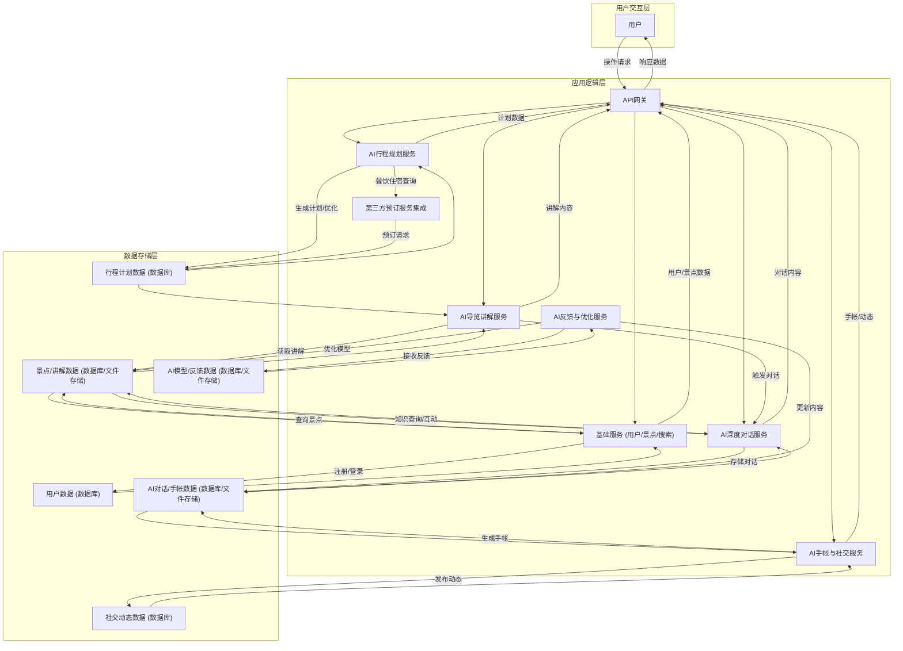
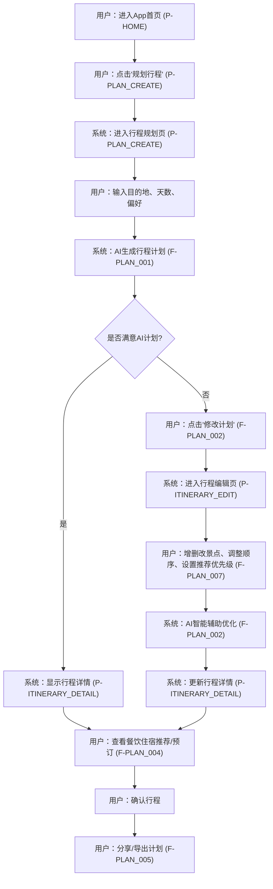
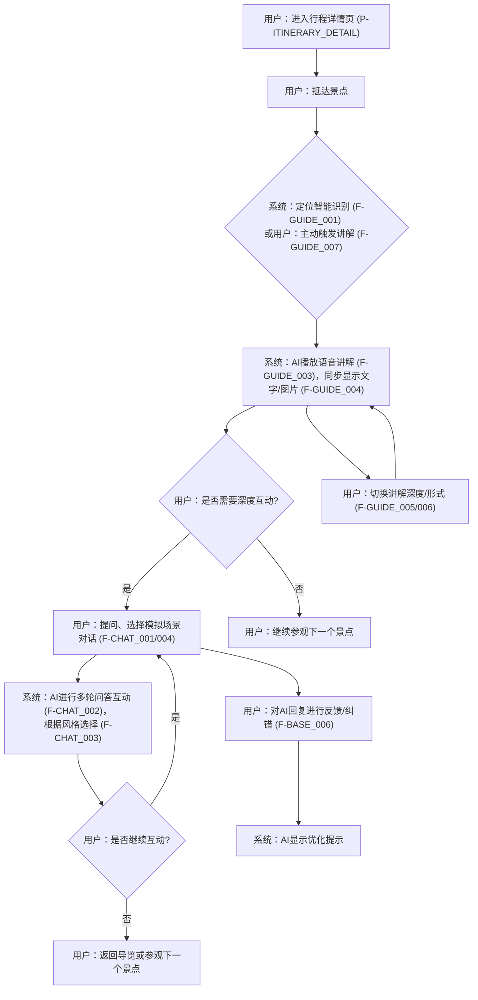
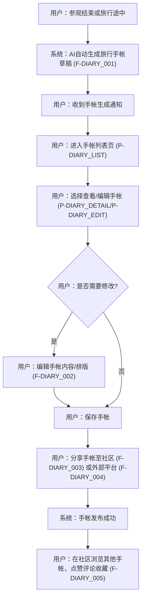

# 寻迹之旅产品需求文档

## 1. 产品概述

### 1.1 产品名称与定位

*   **产品名称**: 寻迹之旅
*   **产品定位**: 一款基于AI智能推荐与讲解的全球博物馆及景点导览移动应用工具。
*   **产品应用语言**: 简体中文、英文、日语、韩语、法语、德语、西班牙语。
*   **产品愿景**: 成为用户探索全球文化艺术、沉浸式体验历史的智能伴侣，让每一次旅行都充满深度与个性。
*   **核心价值主张**: AI驱动的个性化体验、全球范围的知识探索、沉浸式互动学习、便捷的旅行记录与分享。

### 1.2 目标用户群体分析

*   **核心用户**: 文化艺术爱好者、自由行游客、学生群体（K12/大学生）、家庭亲子用户、数字科技尝鲜者。
*   **潜在用户**: 商务旅行者。
*   **解决痛点**: 用户在博物馆和景点参观中体验不足，信息获取不便，讲解缺乏深度和个性化；旅行规划复杂；旅行记录和分享不便。

### 1.3 产品使用终端

*   移动端APP（支持iOS和Android操作系统）。

### 1.4 市场需求与竞品简析

*   **市场需求**: 随着文旅融合的深入和个性化、深度游需求的增长，用户对智能导览、个性化行程规划和沉浸式文化体验的需求日益旺盛。传统导览方式存在信息单一、互动性差、缺乏个性化等痛点。
*   **竞品分析**:
    *   **传统语音导览器/人工讲解**: 优势在于专业性，但覆盖范围有限，互动性差，无法个性化。
    *   **现有旅游APP**: 多侧重于信息聚合、路线规划或社交分享，但在AI智能讲解和深度互动方面有待提升。
    *   **AI聊天机器人**: 具备一定的交互能力，但缺乏与地理位置、多媒体内容结合的沉浸式体验。
*   **寻迹之旅优势**: 通过AI技术整合行程规划、智能导览、深度对话和手帐生成，提供一站式、高度个性化和沉浸式的文化旅游体验，形成差异化竞争优势。

## 2. 功能规格

### 2.1 功能详述

### 2.1.1 AI行程规划模块 (F-PLAN)

| 功能ID | 功能名称 | 功能描述 | 优先级 |
|--------|---------|---------|--------|
| F-PLAN_001 | 智能计划生成 | AI根据用户输入的目的地、天数、偏好等信息，自动生成详细出行计划，包含景点推荐、顺序规划、时长、餐饮住宿参考及AI讲解预告。AI在规划时综合平衡用户满意度、景点多样性、等待时间等因素，确保推荐结果体现多样性、路线流畅、高度契合用户偏好，并提供多种选择方案。 | P0 |
| F-PLAN_002 | 计划内容修改与优化 | 用户可对AI生成的计划进行修改、增删、拖拽调整。修改后，AI将智能调整剩余行程以确保顺畅性（避免走回头路、参观节奏舒适、交通便捷、减少排队等待时间、信息获取及时准确），并重新评估行程时间与交通方案。 | P0 |
| F-PLAN_003 | 计划跳过功能 | 用户可选择跳过AI生成，直接进入手动规划或导览。 | P1 |
| F-PLAN_004 | 计划查看详情 | 展示路线地图、景点列表、行程时间轴、餐饮住宿推荐及预订入口、AI讲解预告。餐饮住宿推荐将集成亚洲区域性第三方预订平台（如携程、去哪儿），主要考量平台覆盖率、API稳定性、价格竞争力、用户评价、特定国家/地区支持、主要亚洲旅游目的地覆盖及多种住宿类型。 | P0 |
| F-PLAN_005 | 计划分享/导出 | 支持将行程计划分享给好友或导出为PDF/图片。 | P1 |
| F-PLAN_006 | 排队等待预测展示 | 当AI预测出建议的最佳参观时段和拥挤度等级标识时，通过时间轴或热力图叠加在地图上直观呈现，热力图颜色强度代表景点推荐指数（人少时推荐）。推荐指数综合考虑景点内容丰富度与独特性、用户历史偏好与兴趣、实时景点评价或星级、用户当前位置与交通便利性、季节性或活动热度，并由系统根据算法自动平衡。 | P0 |
| F-PLAN_007 | 推荐侧重点优先级设置 | 用户可以根据自己的需求，对“历史文化探索”、“亲子友好景点”、“热门打卡景点”、“小众深度体验景点”、“自然风光欣赏”、“高效避峰参观”等推荐侧重点进行自由排序或权重设置。该设置可设置为默认值，但每次行程可覆盖，通过拖拽排序列表进行交互。 | P1 |

### 2.1.2 AI导览讲解模块 (F-GUIDE)

| 功能ID | 功能名称 | 功能描述 | 优先级 |
|--------|---------|---------|--------|
| F-GUIDE_001 | 定位智能识别 | 通过GPS/蓝牙识别用户当前位置，当用户接近景点或展品时自动触发讲解。 | P0 |
| F-GUIDE_002 | 照片组合讲解 | AI结合用户上传的同一展品/景点不同角度的照片或同一区域内多个不同展品/景点的照片内容，提供定制讲解。 | P0 |
| F-GUIDE_003 | 语音讲解播放 | 提供多种音色的语音讲解，支持播放、暂停、快进、快退等控制功能。 | P0 |
| F-GUIDE_004 | 文字/图片辅助讲解 | 语音讲解同步展示文字稿，并配有辅助图片和多媒体资料。 | P0 |
| F-GUIDE_005 | 讲解深度切换 | 支持在“简介”、“深度解析”间切换讲解内容。用户可在设置中预设讲解深度，并默认自动生效。 | P0 |
| F-GUIDE_006 | 讲解形式切换 | 支持在“故事性”、“知识性”间切换讲解风格。用户可在设置中预设讲解形式，并默认自动生效。 | P0 |
| F-GUIDE_007 | 主动讲解触发 | 用户可通过点击屏幕、扫码、语音指令或拍照识别文物/景点等方式主动触发讲解。 | P0 |
| F-GUIDE_008 | 多语言讲解 | 提供简体中文、英文、日语、韩语、法语、德语、西班牙语等多语言讲解版本。 | P0 |

### 2.1.3 AI深度对话模块 (F-CHAT)

| 功能ID | 功能名称 | 功能描述 | 优先级 |
|--------|---------|---------|--------|
| F-CHAT_001 | 知识点提问 | 用户可随时向AI讲解员提问，获取景点或展品相关的知识点。 | P0 |
| F-CHAT_002 | 多轮问答互动 | 支持连续多轮对话，AI能理解上下文并进行有逻辑的互动。 | P0 |
| F-CHAT_003 | 讲解员风格选择与智能推荐 | 用户可选不同AI讲解员的“人设”或风格，包括严谨的学者型、活泼生动的导游型、富有故事感的叙述型、幽默风趣的互动型、沉稳的历史学家型。应用将提供每种风格的简短文字介绍和语音示例，并根据用户历史行为（过去选择的讲解风格、浏览/收藏景点类型、对话提问方式、手帐记录偏好、注册兴趣标签）进行智能推荐。用户明确设置的偏好优先级更高。 | P0 |
| F-CHAT_004 | 模拟场景对话 | 支持模拟场景对话，如重现历史事件中的关键对话、与历史人物进行角色扮演式交流。AI的回复严格遵循历史事实，当遇到历史记载不完整或争议时，根据主流史学观点提供解释并注明来源（简洁文本标注或可点击链接）。核心互动方式为文字输入与AI文本回复，以及语音输入与AI语音回复。 | P0 |
| F-CHAT_005 | 小测验与游戏互动 | 提供与景点或讲解内容相关的小测验或知识问答游戏，增强学习趣味性。 | P1 |
| F-CHAT_006 | 情感反馈与陪伴 | AI在对话中提供情感反馈，提升用户体验，提供一定的陪伴感。 | P1 |

### 2.1.4 AI手帐与社交分享模块 (F-DIARY)

| 功能ID | 功能名称 | 功能描述 | 优先级 |
|--------|---------|---------|--------|
| F-DIARY_001 | 自动生成手帐 | AI根据用户在参观过程中拍摄的照片/视频、讲解摘要、地理位置信息、AI对话中的亮点互动、参观景点的时间轴、推荐的后续参观或相关知识点等元素，自动生成精美杂志排版风格的旅行手帐。手帐提供1-3个固定模板，均采用“多图组合拼贴 + 简短说明”的布局结构。 | P0 |
| F-DIARY_002 | 手帐内容编辑 | 用户可对AI生成的手帐内容进行编辑、增删、调整排版，包括图片、文字、布局等。 | P0 |
| F-DIARY_003 | APP内动态发布 | 用户可将手帐或旅行动态发布到APP社区，供其他用户浏览互动。 | P1 |
| F-DIARY_004 | 分享至外部平台 | 支持将手帐或旅行动态分享至微信、微博等外部社交平台。 | P1 |
| F-DIARY_005 | 点赞评论收藏 | 用户可在社区内对其他用户的动态进行点赞、评论和收藏。 | P1 |

### 2.1.5 基础功能模块 (F-BASE)

| 功能ID | 功能名称 | 功能描述 | 优先级 |
|--------|---------|---------|--------|
| F-BASE_001 | 用户注册/登录 | 支持手机号、第三方（微信、Apple ID等）登录，提供密码找回功能。 | P0 |
| F-BASE_002 | 个人信息管理 | 用户可设置头像、昵称、个性签名等个人信息。 | P0 |
| F-BASE_003 | 偏好设置 | 用户可设置APP语言、通知偏好、AI讲解员默认风格等。 | P0 |
| F-BASE_004 | 全球景点库 | 维护全球范围内的景点和博物馆信息，包含文字介绍、图片、地理位置、开放时间等。 | P0 |
| F-BASE_005 | 搜索功能 | 提供全局搜索功能，可搜索景点、手帐、用户等信息。 | P0 |
| F-BASE_006 | AI内容反馈与优化 | 当AI生成内容出现偏差或错误时，用户可通过“纠错”按钮（AI即时调整，仅针对用户本人可见）、“提交反馈”（触发人工审核并用于长期模型优化、数据收集）或手动编辑AI生成内容进行修正。当AI回答与反馈相关的问题时，会在AI回复底部以“此内容已根据您的反馈优化”的简短文本提示用户，该提示带有短暂动画效果，持续5-10秒后自动淡出，并在用户切换到其他对话或页面后自动消失。 | P0 |

### 2.2 功能模块间的关系图



## 3. 用户流程

### 3.1 用户旅程地图

| 阶段 | 用户行为 | 痛点/需求 | 寻迹之旅提供 | 期望体验 |
|---|---|---|---|---|
| **行前准备** | 规划目的地、搜索景点、安排行程 | 规划耗时、信息零散、缺乏个性化推荐 | AI智能行程规划 (F-PLAN_001)，个性化推荐 (F-PLAN_007)，第三方预订 (F-PLAN_004) | 轻松、高效、个性化、无缝衔接 |
| **行中体验** | 抵达景点、参观展品、获取讲解、深度互动 | 讲解枯燥、信息不全、缺乏互动、排队拥挤 | AI智能导览 (F-GUIDE_001-008)，AI深度对话 (F-CHAT_001-006)，排队预测 (F-PLAN_006) | 沉浸、有趣、有深度、省心 |
| **行后回顾** | 回顾旅行、整理照片、分享体验、与他人交流 | 记录繁琐、分享不便、缺乏沉淀 | AI手帐自动生成 (F-DIARY_001)，编辑分享 (F-DIARY_002-004)，社区互动 (F-DIARY_005) | 便捷、美观、有成就感、有共鸣 |

### 3.2 关键路径流程图

#### 3.2.1 AI行程规划与修改流程



#### 3.2.2 景点AI导览与深度对话流程



#### 3.2.3 AI手帐生成与社交分享流程



### 3.3 各场景下的用户操作步骤

#### 3.3.1 创建并修改出行计划

1.  **打开App**: 用户启动“寻迹之旅”App，进入首页（P-HOME）。
2.  **启动规划**: 点击首页底部导航栏的“规划”图标，进入行程规划页（P-PLAN_CREATE）。
3.  **输入信息**: 在行程规划页（P-PLAN_CREATE）输入目的地（如“北京”）、出行天数（如“3天”）、旅行偏好（如“历史文化”、“亲子”）。
4.  **生成计划**: 点击“智能生成计划”按钮，系统AI开始根据输入信息生成行程计划。
5.  **查看计划**: AI生成计划后，自动跳转至行程详情页（P-ITINERARY_DETAIL），展示行程概览、地图、景点列表、餐饮住宿推荐和AI讲解预告。同时显示景点推荐指数热力图。
6.  **修改计划**: 如果用户对AI生成的计划不满意，点击行程详情页（P-ITINERARY_DETAIL）上的“编辑”按钮，进入行程编辑页（P-ITINERARY_EDIT）。
7.  **调整景点**: 在行程编辑页（P-ITINERARY_EDIT）中，用户可以通过拖拽调整景点顺序，点击“+”添加新景点，点击“-”删除景点。
8.  **设置推荐优先级**: 在行程编辑页（P-ITINERARY_EDIT）中，用户点击“推荐偏好设置”进入推荐优先级设置页（P-RECOMMEND_PRIORITY_SET），通过拖拽排序列表调整“历史文化探索”、“亲子友好景点”等侧重点的优先级。
9.  **AI辅助优化**: 用户完成修改后，点击“保存并优化”按钮，AI根据用户修改智能调整行程，确保顺畅性（如避免回头路、重新评估交通时间），并更新行程详情。
10. **预订餐饮住宿**: 在行程详情页（P-ITINERARY_DETAIL）中，点击餐饮或住宿推荐项，弹出预订平台选择页（P-BOOKING_PLATFORM_SELECT），选择携程或去哪儿进行预订。
11. **分享/导出**: 点击行程详情页（P-ITINERARY_DETAIL）上的“分享”图标，选择分享至社交媒体或导出为PDF。

#### 3.3.2 使用AI讲解员进行导览

1.  **进入导览**: 用户在行程详情页（P-ITINERARY_DETAIL）点击“开始导览”按钮，或直接前往景点，进入导览页（P-GUIDE）。
2.  **自动触发讲解**: 当用户携带手机接近景点或展品时，系统通过GPS/蓝牙智能识别位置，自动播放当前展品的语音讲解（F-GUIDE_001）。
3.  **主动触发讲解**: 用户也可点击导览页（P-GUIDE）上的“拍照识别”按钮拍摄展品，或点击屏幕上的展品图标，或通过语音指令“讲解这个”，触发讲解（F-GUIDE_007）。
4.  **切换讲解模式**: 在导览页（P-GUIDE）中，用户可以通过设置中预设的默认模式（深度/简介，故事性/知识性）听取讲解。如需临时切换，可通过手势操作（如左右滑动）快速切换讲解深度（F-GUIDE_005）和形式（F-GUIDE_006）。
5.  **深度对话**: 听完讲解后，用户对某个知识点感兴趣，点击导览页（P-GUIDE）上的“问AI”按钮，进入AI对话页（P-AI_CHAT）。
6.  **提问与互动**: 在AI对话页（P-AI_CHAT），用户可通过文字或语音向AI讲解员提问（F-CHAT_001），例如“这个文物是谁制造的？”。AI将进行多轮问答互动，并根据用户选择的讲解员风格进行回复（F-CHAT_002/003）。
7.  **模拟场景**: 用户也可选择“模拟场景对话”，如“我想和李白对话”，AI将模拟李白进行角色扮演式交流（F-CHAT_004）。
8.  **反馈纠错**: 如果用户发现AI讲解或对话内容有误，可在对话框底部点击“纠错”按钮或长按内容提交反馈（F-BASE_006）。系统会在AI回复底部提示内容已优化。

#### 3.3.3 生成并分享旅行手帐

1.  **结束行程**: 用户完成一天或整个行程后，App会收到通知，提示AI已自动生成旅行手帐草稿。
2.  **查看手帐**: 用户点击通知或通过App底部导航栏进入“我的”页面（P-PROFILE），选择“我的手帐”，进入手帐列表页（P-DIARY_LIST）。
3.  **编辑手帐**: 点击最新的手帐草稿，进入手帐详情页（P-DIARY_DETAIL）。点击“编辑”按钮，进入手帐编辑页（P-DIARY_EDIT）。
4.  **调整内容**: 在手帐编辑页（P-DIARY_EDIT），用户可添加、删除或修改照片/视频，调整文字描述，选择不同的“多图组合拼贴 + 简短说明”布局模板，以符合“精美杂志排版风格”（F-DIARY_002）。
5.  **发布分享**: 编辑完成后，点击“发布”按钮。选择发布到App社区（P-COMMUNITY_FEED）或分享至微信、微博等外部平台（F-DIARY_003/004）。
6.  **社区互动**: 用户可在社区动态页（P-COMMUNITY_FEED）浏览其他用户发布的手帐，进行点赞、评论和收藏（F-DIARY_005）。

## 4. 数据流设计

### 4.1 数据结构与关系

| 数据实体 | 字段 | 类型 | 描述 | 关系 |
|----------|------|------|------|------|
| **用户 (User)** | UserID | String | 用户唯一标识 | 一对多 (用户 -> 行程计划) <br> 一对多 (用户 -> 手帐) <br> 一对多 (用户 -> 动态) <br> 一对多 (用户 -> 评论/点赞/收藏) |
| | Username | String | 用户名 | |
| | Avatar | URL | 头像地址 | |
| | PasswordHash | String | 密码哈希 | |
| | PhoneNumber | String | 手机号 | |
| | ThirdPartyID | String | 第三方登录ID (微信/Apple ID) | |
| | Preferences | JSON | 用户偏好设置 (语言、通知、AI讲解员风格) | |
| | HistoryBehaviors | JSON | 用户历史行为数据 (浏览、互动、收藏) | |
| **景点 (Attraction)** | AttractionID | String | 景点唯一标识 | 一对多 (景点 -> 讲解内容) <br> 多对多 (行程计划 <-> 景点) |
| | Name | String | 景点名称 | |
| | Location | GeoJSON | 地理坐标 (经纬度) | |
| | Description | Text | 景点简介 | |
| | Images | Array<URL> | 景点图片 | |
| | OpeningHours | JSON | 开放时间 | |
| | TicketInfo | Text | 门票信息 | |
| | AverageRating | Float | 平均评分 | |
| | RealtimeCrowd | JSON | 实时人流量数据 (AI预测) | |
| **讲解内容 (ExplanationContent)** | ContentID | String | 讲解内容唯一标识 | 一对一 (景点 -> 讲解内容) |
| | AttractionID | String | 所属景点ID | |
| | Type | Enum | 讲解类型 (简介/深度解析, 故事性/知识性) | |
| | Language | String | 语言 (中文、英文等) | |
| | AudioURL | URL | 语音讲解文件地址 | |
| | TextContent | Text | 文字讲解稿 | |
| | Images | Array<URL> | 辅助图片 | |
| | HistoricalSources | Array<Text> | 历史文献来源 | |
| **行程计划 (ItineraryPlan)** | PlanID | String | 行程计划唯一标识 | 一对多 (用户 -> 行程计划) |
| | UserID | String | 用户ID | |
| | PlanName | String | 计划名称 | |
| | Destination | String | 目的地 | |
| | Days | Integer | 天数 | |
| | Preferences | JSON | 用户规划偏好 (历史文化、亲子等) | |
| | Attractions | Array<AttractionID> | 景点列表 (包含顺序、预计停留时间) | |
| | DiningSuggestions | Array<JSON> | 餐饮推荐 (包含预订链接) | |
| | AccommodationSuggestions | Array<JSON> | 住宿推荐 (包含预订链接) | |
| | GeneratedTime | Timestamp | 生成时间 | |
| | LastModifiedTime | Timestamp | 最后修改时间 | |
| **AI对话记录 (AIChatRecord)** | ChatID | String | 对话唯一标识 | 一对多 (用户 -> 对话记录) |
| | UserID | String | 用户ID | |
| | InteractionLog | Array<JSON> | 对话历史 (用户提问、AI回复、时间戳) | |
| | AIStyle | String | 使用的AI讲解员风格 | |
| | RelatedAttractionID | String | 相关景点ID | |
| **旅行手帐 (TravelDiary)** | DiaryID | String | 手帐唯一标识 | 一对多 (用户 -> 手帐) |
| | UserID | String | 用户ID | |
| | Title | String | 手帐标题 | |
| | CoverImage | URL | 封面图片 | |
| | ContentBlocks | Array<JSON> | 内容块 (图片/视频URL、文字、讲解摘要、对话亮点) | |
| | LayoutTemplate | String | 使用的模板ID | |
| | GeneratedTime | Timestamp | 生成时间 | |
| | LastEditedTime | Timestamp | 最后编辑时间 | |
| | LocationTags | Array<GeoJSON> | 地理位置标签 | |
| **社交动态 (SocialFeed)** | PostID | String | 动态唯一标识 | 一对多 (用户 -> 动态) |
| | UserID | String | 用户ID | |
| | DiaryID | String | 关联手帐ID (可选) | |
| | Content | Text | 动态文字内容 | |
| | Media | Array<URL> | 图片/视频URL | |
| | PostTime | Timestamp | 发布时间 | |
| | LikesCount | Integer | 点赞数 | |
| | CommentsCount | Integer | 评论数 | |
| **评论 (Comment)** | CommentID | String | 评论唯一标识 | 一对多 (动态 -> 评论) <br> 一对多 (评论 -> 评论) |
| | PostID | String | 所属动态ID | |
| | UserID | String | 评论用户ID | |
| | Content | Text | 评论内容 | |
| | CommentTime | Timestamp | 评论时间 | |
| | ParentCommentID | String | 父评论ID (用于回复) | |
| **点赞 (Like)** | LikeID | String | 点赞唯一标识 | 一对多 (动态 -> 点赞) |
| | PostID | String | 所属动态ID | |
| | UserID | String | 点赞用户ID | |
| | LikeTime | Timestamp | 点赞时间 | |
| **收藏 (Favorite)** | FavID | String | 收藏唯一标识 | 一对多 (用户 -> 收藏) |
| | UserID | String | 用户ID | |
| | ItemID | String | 收藏项ID (景点、手帐、动态) | |
| | ItemType | Enum | 收藏项类型 | |
| | FavTime | Timestamp | 收藏时间 | |
| **AI反馈 (AIFeedback)** | FeedbackID | String | 反馈唯一标识 | 一对多 (用户 -> 反馈) |
| | UserID | String | 用户ID | |
| | ContentID | String | 关联的AI生成内容ID (讲解/对话/手帐) | |
| | ContentType | Enum | AI生成内容类型 | |
| | FeedbackType | Enum | 反馈类型 (错误/建议/纠错) | |
| | Description | Text | 反馈描述 | |
| | FeedbackTime | Timestamp | 反馈时间 | |
| | Status | Enum | 处理状态 (待处理/已采纳/已忽略) | |

### 4.2 关键数据流向图

```mermaid
graph TD
    subgraph "用户界面层"
        U_App["移动App (iOS/Android)"]
    end

    subgraph "应用服务层"
        AS_Gateway["API网关"]
        AS_User["用户服务"]
        AS_Attraction["景点服务"]
        AS_Plan["行程规划服务"]
        AS_Guide["导览讲解服务"]
        AS_Chat["深度对话服务"]
        AS_Diary["手帐服务"]
        AS_Social["社交服务"]
        AS_Feedback["AI反馈服务"]
        AS_ThirdParty["第三方集成服务"]
    end

    subgraph "AI智能服务层"
        AI_Planner["AI规划引擎"]
        AI_Recognizer["AI识别引擎 (定位/图像/语音)"]
        AI_Explainer["AI讲解引擎 (NLP/TTS)"]
        AI_Chatbot["AI对话引擎 (LLM/NLU)"]
        AI_DiaryGen["AI手帐生成引擎"]
    end

    subgraph "数据存储层"
        DS_DB["核心数据库 (用户/景点/计划/手帐等)"]
        DS_File["文件存储 (图片/语音/视频)"]
        DS_VectorDB["向量数据库 (AI模型/语义检索)"]
        DS_Cache["缓存服务"]
    end

    U_App --"用户操作"--> AS_Gateway

    AS_Gateway --"用户注册/登录"--> AS_User
    AS_User --"读写用户数据"--> DS_DB

    AS_Gateway --"景点查询"--> AS_Attraction
    AS_Attraction --"读景点数据"--> DS_DB
    AS_Attraction --"实时人流量/热力图"--> AI_Planner
    
    AS_Gateway --"生成行程"--> AS_Plan
    AS_Plan --"调用AI规划"--> AI_Planner
    AI_Planner --"读取景点/用户偏好"--> DS_DB
    AI_Planner --"写入行程计划"--> DS_DB
    AI_Planner --"预测等待时间"--> DS_DB
    AS_Plan --"餐饮住宿预订"--> AS_ThirdParty
    AS_ThirdParty --"与第三方平台交互"--> DS_Cache
    AS_Plan --"读写行程计划"--> DS_DB
    
    AS_Gateway --"开始导览"--> AS_Guide
    AS_Guide --"定位/识别"--> AI_Recognizer
    AI_Recognizer --"触发讲解"--> AS_Guide
    AS_Guide --"获取讲解内容"--> AI_Explainer
    AI_Explainer --"读取讲解文本/语音/图片"--> DS_DB
    AI_Explainer --"生成语音/文字"--> DS_File
    
    AS_Gateway --"发起对话"--> AS_Chat
    AS_Chat --"调用AI对话"--> AI_Chatbot
    AI_Chatbot --"读取知识库/历史数据"--> DS_VectorDB
    AI_Chatbot --"存储对话记录"--> DS_DB
    
    AS_Gateway --"生成手帐"--> AS_Diary
    AS_Diary --"调用AI手帐生成"--> AI_DiaryGen
    AI_DiaryGen --"读取用户数据/照片/讲解摘要/对话亮点"--> DS_DB
    AI_DiaryGen --"写入手帐内容/文件"--> DS_DB
    
    AS_Gateway --"发布/浏览动态"--> AS_Social
    AS_Social --"读写社交数据"--> DS_DB
    
    AS_Gateway --"提交反馈"--> AS_Feedback
    AS_Feedback --"写入反馈数据"--> DS_DB
    AS_Feedback --"触发AI模型优化/人工审核"--> AI_Explainer
    AS_Feedback --"优化模型"--> AI_Chatbot
    AS_Feedback --"优化模型"--> AI_Planner
    
    AS_Gateway <-- "响应数据" --- U_App
    DS_DB <--> DS_File
    DS_DB <--> DS_VectorDB
    DS_Cache <--> DS_DB
```

### 4.3 数据存储与处理原则

1.  **数据安全与隐私保护**:
    *   用户个人敏感信息（如手机号、密码）进行加密存储和传输。
    *   严格遵守数据隐私法规，确保用户数据在收集、存储、使用、共享、删除等环节的合规性。
    *   用户生成内容（照片、手帐、对话记录）默认仅用户可见，分享行为需用户明确授权。
2.  **可扩展性**:
    *   采用微服务架构，各服务模块独立部署、弹性伸缩，以应对未来用户量和功能模块的增长。
    *   数据库设计考虑分库分表、读写分离等方案，确保在大数据量下的性能表现。
3.  **数据一致性**:
    *   采用事务机制或最终一致性方案，确保分布式系统中的数据一致性。
    *   关键业务数据（如行程计划、手帐内容）提供版本管理和回溯功能。
4.  **AI数据处理**:
    *   AI模型训练数据进行脱敏处理，避免泄露用户隐私。
    *   用户对AI内容的反馈将用于模型的持续迭代优化，提升准确性和用户体验。
    *   AI生成内容（讲解、对话、手帐）的版权归属明确，并提供用户编辑和修正能力。
5.  **多语言支持**:
    *   所有用户可见的文本内容、语音讲解、系统提示均支持多语言切换。
    *   景点数据和讲解内容支持多语言版本存储和检索。

## 5. 页面规格

### 5.1 页面概览

| 页面ID | 页面名称 | 核心功能 |
|--------|---------|---------|
| P-LOGIN_REGISTER | 登录/注册页 | 用户身份验证 |
| P-HOME | 首页 | 应用入口，内容聚合与快速导航 |
| P-PLAN_CREATE | 行程规划页 | AI智能行程生成 |
| P-ITINERARY_DETAIL | 行程详情页 | 展示行程计划、预订入口、AI讲解预告 |
| P-ITINERARY_EDIT | 行程编辑页 | 修改行程计划、AI辅助优化 |
| P-GUIDE | 导览页 | 景点AI智能讲解与互动 |
| P-AI_CHAT | AI对话页 | 深度问答、模拟场景对话、小测验 |
| P-DIARY_LIST | 手帐列表页 | 展示用户所有手帐 |
| P-DIARY_DETAIL | 手帐详情页 | 查看单篇手帐内容 |
| P-DIARY_EDIT | 手帐编辑页 | 自动手帐编辑与发布 |
| P-COMMUNITY_FEED | 社区动态页 | 浏览用户发布的手帐与动态 |
| P-POST_CREATE | 发布动态页 | 发布新的手帐或动态 |
| P-PROFILE | 个人中心页 | 用户个人信息、手帐、收藏管理 |
| P-PROFILE_EDIT | 个人信息编辑页 | 编辑用户个人资料 |
| P-PREFERENCE_SETTINGS | 偏好设置页 | App语言、通知、AI讲解员风格设置 |
| P-ATTRACTION_LIBRARY | 景点库页 | 全球景点浏览与搜索 |
| P-ATTRACTION_DETAIL | 景点详情页 | 单个景点详细信息 |
| P-SEARCH_RESULT | 搜索结果页 | 全局搜索结果展示 |
| P-FEEDBACK_HELP | 反馈与帮助页 | 用户反馈提交、常见问题解答 |
| P-BOOKING_PLATFORM_SELECT | 预订平台选择页 | 选择第三方餐饮住宿预订平台 |
| P-RECOMMEND_PRIORITY_SET | 推荐优先级设置页 | 个性化设置景点推荐侧重点 |
| P-NOTIFICATION_CENTER | 通知中心页 | 系统消息、反馈处理通知 |
| P-PASSWORD_RESET | 忘记密码/修改密码页 | 找回或修改用户密码 |

### 5.2 页面详情

#### 5.2.1 登录/注册页（P-LOGIN_REGISTER）

*   **页面名称与目的**: 登录/注册页（P-LOGIN_REGISTER），提供用户身份验证功能，确保用户数据安全和个性化体验。
*   **页面负责的核心功能**: 用户注册、用户登录、第三方登录、密码找回。
*   **主要UI元素与布局建议**:
    *   顶部Logo和产品名称。
    *   手机号输入框及验证码按钮。
    *   密码输入框（注册时为设置密码）。
    *   第三方登录按钮（微信、Apple ID）。
    *   “注册”/“登录”按钮。
    *   “忘记密码”链接。
    *   用户协议与隐私政策勾选框及链接。
*   **页面需展示的关键数据**: 无。
*   **交互方式说明**:
    *   点击“获取验证码”按钮发送短信验证码。
    *   点击“注册”/“登录”按钮提交表单。
    *   点击第三方登录图标调用第三方SDK进行登录。
    *   点击“忘记密码”跳转至忘记密码/修改密码页（P-PASSWORD_RESET）。
*   **页面间跳转关系**:

| 页面 | 触发组件 | 交互类型 | 目标页面 | 传递参数 |
|:---------|:-------------|:-------|:---------------------|:------------|
| 登录/注册页（P-LOGIN_REGISTER） | 登录/注册成功 | 自动跳转 | 首页（P-HOME） | UserToken |
| 登录/注册页（P-LOGIN_REGISTER） | 忘记密码 | 点击 | 忘记密码/修改密码页（P-PASSWORD_RESET） | 无 |

*   **状态变化与反馈机制**:
    *   手机号/密码格式错误时，输入框下方提示错误信息。
    *   验证码发送成功/失败提示。
    *   登录/注册成功提示，并自动跳转。
    *   第三方登录授权状态提示。

#### 5.2.2 首页（P-HOME）

*   **页面名称与目的**: 首页（P-HOME），App的核心入口，为用户提供个性化推荐、快速功能入口及最新活动信息。
*   **页面负责的核心功能**: 个性化景点推荐、行程规划入口、导览入口、社区动态概览、搜索入口。
*   **主要UI元素与布局建议**:
    *   顶部搜索框与消息通知图标。
    *   顶部轮播图/推荐卡片，展示AI个性化推荐景点或热门活动。
    *   核心功能入口区：如“智能规划”、“开始导览”、“我的手帐”等快捷按钮。
    *   “推荐景点”列表/卡片，展示AI基于用户偏好推荐的景点。
    *   底部导航栏：首页、规划、导览、社区、我的。
*   **页面需展示的关键数据**: 用户推荐景点列表、热门活动信息、社区最新动态摘要。
*   **交互方式说明**:
    *   点击搜索框跳转至搜索结果页（P-SEARCH_RESULT）。
    *   点击消息通知图标跳转至通知中心页（P-NOTIFICATION_CENTER）。
    *   点击推荐卡片或景点列表项跳转至景点详情页（P-ATTRACTION_DETAIL）。
    *   点击“智能规划”按钮跳转至行程规划页（P-PLAN_CREATE）。
    *   点击“开始导览”按钮跳转至导览页（P-GUIDE）。
    *   点击底部导航栏切换模块。
*   **页面间跳转关系**:

| 页面 | 触发组件 | 交互类型 | 目标页面 | 传递参数 |
|:---------|:-------------|:-------|:--------------------------|:------------|
| 首页（P-HOME） | 搜索框 | 点击 | 搜索结果页（P-SEARCH_RESULT） | 无 |
| 首页（P-HOME） | 消息通知图标 | 点击 | 通知中心页（P-NOTIFICATION_CENTER） | 无 |
| 首页（P-HOME） | 推荐景点卡片 | 点击 | 景点详情页（P-ATTRACTION_DETAIL） | AttractionID |
| 首页（P-HOME） | “智能规划”按钮 | 点击 | 行程规划页（P-PLAN_CREATE） | 无 |
| 首页（P-HOME） | “开始导览”按钮 | 点击 | 导览页（P-GUIDE） | 无 |
| 首页（P-HOME） | 底部导航“规划” | 点击 | 行程规划页（P-PLAN_CREATE） | 无 |
| 首页（P-HOME） | 底部导航“导览” | 点击 | 导览页（P-GUIDE） | 无 |
| 首页（P-HOME） | 底部导航“社区” | 点击 | 社区动态页（P-COMMUNITY_FEED） | 无 |
| 首页（P-HOME） | 底部导航“我的” | 点击 | 个人中心页（P-PROFILE） | 无 |
| 登录/注册页（P-LOGIN_REGISTER） | 登录/注册成功 | 自动跳转 | 首页（P-HOME） | UserToken |

*   **状态变化与反馈机制**:
    *   推荐内容根据用户偏好实时更新。
    *   新消息通知图标显示红点或数字。

#### 5.2.3 行程规划页（P-PLAN_CREATE）

*   **页面名称与目的**: 行程规划页（P-PLAN_CREATE），用于用户输入行程基本信息，并触发AI智能生成行程计划。
*   **页面负责的核心功能**: AI智能行程生成、行程基本信息输入。
*   **主要UI元素与布局建议**:
    *   目的地输入框（支持搜索）。
    *   出行天数选择器。
    *   旅行偏好选择器（多选，如历史文化、亲子、美食、自然风光等）。
    *   “智能生成计划”按钮。
    *   “跳过智能生成，手动规划”按钮。
*   **页面需展示的关键数据**: 目的地列表、预设偏好标签。
*   **交互方式说明**:
    *   输入目的地时提供联想词。
    *   点击“智能生成计划”触发AI计算。
    *   点击“跳过智能生成”直接进入手动规划流程。
*   **页面间跳转关系**:

| 页面 | 触发组件 | 交互类型 | 目标页面 | 传递参数 |
|:-----------|:-------------|:-------|:--------------------------|:------------|
| 首页（P-HOME） | “智能规划”按钮 | 点击 | 行程规划页（P-PLAN_CREATE） | 无 |
| 行程规划页（P-PLAN_CREATE） | “智能生成计划”按钮 | 点击 | 行程详情页（P-ITINERARY_DETAIL） | PlanID |
| 行程规划页（P-PLAN_CREATE） | “跳过智能生成”按钮 | 点击 | 行程编辑页（P-ITINERARY_EDIT） | PlanID=NewDraft |

*   **状态变化与反馈机制**:
    *   生成计划时显示加载动画。
    *   偏好选择器显示已选中的标签。

#### 5.2.4 行程详情页（P-ITINERARY_DETAIL）

*   **页面名称与目的**: 行程详情页（P-ITINERARY_DETAIL），展示AI生成或用户修改后的详细行程计划，包含地图、景点、餐饮住宿等信息。
*   **页面负责的核心功能**: 行程计划展示、餐饮住宿预订入口、AI讲解预告、排队预测。
*   **主要UI元素与布局建议**:
    *   顶部行程名称与日期。
    *   路线地图：展示景点位置、规划路线、热力图（人流拥挤度）。
    *   景点列表：按时间顺序展示，包含景点名称、预计停留时间。
    *   餐饮住宿推荐区域，展示推荐商家信息。
    *   “编辑计划”按钮。
    *   “开始导览”按钮。
    *   “分享/导出”按钮。
*   **页面需展示的关键数据**: 行程名称、目的地、天数、景点列表（AttractionID, Name, EstimatedTime）、路线信息、餐饮住宿推荐（Name, Rating, Price, BookingLink）、AI讲解预告、景点实时人流预测（建议最佳参观时段、拥挤度等级）。
*   **交互方式说明**:
    *   点击地图上景点图标，显示景点简介浮窗。
    *   点击景点列表项跳转至景点详情页（P-ATTRACTION_DETAIL）。
    *   点击餐饮住宿推荐项，弹出预订平台选择页（P-BOOKING_PLATFORM_SELECT）。
    *   点击“编辑计划”跳转至行程编辑页（P-ITINERARY_EDIT）。
    *   点击“开始导览”跳转至导览页（P-GUIDE）。
    *   点击“分享/导出”触发分享/导出功能。
*   **页面间跳转关系**:

| 页面 | 触发组件 | 交互类型 | 目标页面 | 传递参数 |
|:-------------|:-------------|:-------|:--------------------------|:------------|
| 行程规划页（P-PLAN_CREATE） | “智能生成计划”按钮 | 点击 | 行程详情页（P-ITINERARY_DETAIL） | PlanID |
| 行程编辑页（P-ITINERARY_EDIT） | 保存计划 | 自动跳转 | 行程详情页（P-ITINERARY_DETAIL） | PlanID |
| 行程详情页（P-ITINERARY_DETAIL） | 地图景点图标 | 点击 | 景点详情页（P-ATTRACTION_DETAIL） | AttractionID |
| 行程详情页（P-ITINERARY_DETAIL） | 景点列表项 | 点击 | 景点详情页（P-ATTRACTION_DETAIL） | AttractionID |
| 行程详情页（P-ITINERARY_DETAIL） | 餐饮/住宿推荐 | 点击 | 预订平台选择页（P-BOOKING_PLATFORM_SELECT） | ItemType, ItemID |
| 行程详情页（P-ITINERARY_DETAIL） | “编辑计划”按钮 | 点击 | 行程编辑页（P-ITINERARY_EDIT） | PlanID |
| 行程详情页（P-ITINERARY_DETAIL） | “开始导览”按钮 | 点击 | 导览页（P-GUIDE） | PlanID, CurrentAttractionID |

*   **状态变化与反馈机制**:
    *   地图热力图实时更新人流拥挤度。
    *   预订成功/失败提示。

#### 5.2.5 行程编辑页（P-ITINERARY_EDIT）

*   **页面名称与目的**: 行程编辑页（P-ITINERARY_EDIT），供用户对AI生成的行程计划进行个性化修改和调整。
*   **页面负责的核心功能**: 景点增删改、景点排序、AI辅助优化、推荐侧重点优先级设置。
*   **主要UI元素与布局建议**:
    *   顶部行程名称可编辑。
    *   可拖拽排序的景点列表，每个景点项包含名称、预计停留时间。
    *   每个景点项旁有“删除”按钮。
    *   底部“添加景点”按钮。
    *   “推荐偏好设置”入口。
    *   “保存并优化”按钮。
*   **页面需展示的关键数据**: 当前行程的景点列表（AttractionID, Name, EstimatedTime）。
*   **交互方式说明**:
    *   拖拽景点项调整顺序。
    *   点击“删除”按钮移除景点。
    *   点击“添加景点”进入景点库页（P-ATTRACTION_LIBRARY）选择新景点。
    *   点击“推荐偏好设置”跳转至推荐优先级设置页（P-RECOMMEND_PRIORITY_SET）。
    *   点击“保存并优化”触发AI优化并保存计划。
*   **页面间跳转关系**:

| 页面 | 触发组件 | 交互类型 | 目标页面 | 传递参数 |
|:-------------|:-------------|:-------|:-----------------------------|:------------|
| 行程详情页（P-ITINERARY_DETAIL） | “编辑计划”按钮 | 点击 | 行程编辑页（P-ITINERARY_EDIT） | PlanID |
| 行程规划页（P-PLAN_CREATE） | “跳过智能生成”按钮 | 点击 | 行程编辑页（P-ITINERARY_EDIT） | PlanID=NewDraft |
| 行程编辑页（P-ITINERARY_EDIT） | “添加景点”按钮 | 点击 | 景点库页（P-ATTRACTION_LIBRARY） | Mode=SelectAttraction |
| 行程编辑页（P-ITINERARY_EDIT） | “推荐偏好设置”入口 | 点击 | 推荐优先级设置页（P-RECOMMEND_PRIORITY_SET） | CurrentPlanID |
| 行程编辑页（P-ITINERARY_EDIT） | “保存并优化”按钮 | 点击 | 行程详情页（P-ITINERARY_DETAIL） | PlanID |

*   **状态变化与反馈机制**:
    *   拖拽时显示视觉反馈。
    *   保存成功后提示“行程已优化并保存”。

#### 5.2.6 导览页（P-GUIDE）

*   **页面名称与目的**: 导览页（P-GUIDE），提供景点AI智能讲解，支持多种触发方式和讲解模式切换。
*   **页面负责的核心功能**: 智能定位触发讲解、多媒体讲解播放、讲解深度/形式切换、主动触发讲解、照片组合讲解。
*   **主要UI元素与布局建议**:
    *   顶部当前景点/展品名称。
    *   中央大图区域展示展品/景点图片。
    *   语音播放控制条（播放/暂停/快进/快退）。
    *   文字讲解稿区域，支持滚动查看。
    *   “问AI”按钮（进入AI对话）。
    *   “拍照识别”按钮。
    *   “扫码触发”按钮。
    *   底部导航栏：导览、地图、更多。
*   **页面需展示的关键数据**: 当前景点/展品名称、图片、语音讲解文件、文字讲解稿。
*   **交互方式说明**:
    *   用户接近景点时自动触发讲解。
    *   点击“拍照识别”上传照片，AI进行照片组合讲解。
    *   点击“问AI”跳转至AI对话页（P-AI_CHAT）。
    *   通过手势操作（如左右滑动）切换讲解深度/形式。
    *   点击底部导航栏切换模块。
*   **页面间跳转关系**:

| 页面 | 触发组件 | 交互类型 | 目标页面 | 传递参数 |
|:---------|:-------------|:-------|:--------------------------|:------------|
| 行程详情页（P-ITINERARY_DETAIL） | “开始导览”按钮 | 点击 | 导览页（P-GUIDE） | PlanID, CurrentAttractionID |
| 导览页（P-GUIDE） | “问AI”按钮 | 点击 | AI对话页（P-AI_CHAT） | AttractionID, ExplanationID |

*   **状态变化与反馈机制**:
    *   讲解播放进度条实时更新。
    *   定位成功/失败提示。
    *   拍照识别结果提示。

#### 5.2.7 AI对话页（P-AI_CHAT）

*   **页面名称与目的**: AI对话页（P-AI_CHAT），提供用户与AI讲解员的深度互动功能，包括知识点提问、多轮问答、模拟场景对话和小测验。
*   **页面负责的核心功能**: 知识点提问、多轮问答互动、讲解员风格选择、模拟场景对话、小测验。
*   **主要UI元素与布局建议**:
    *   顶部AI讲解员头像与名称。
    *   对话气泡列表，展示用户提问和AI回复。
    *   底部输入框（支持文字/语音输入）。
    *   底部快捷功能按钮：如“切换风格”、“模拟场景”、“小测验”。
*   **页面需展示的关键数据**: 对话历史记录（用户问题、AI回复、时间戳）、AI讲解员当前风格。
*   **交互方式说明**:
    *   在输入框输入文字或点击语音按钮进行语音输入。
    *   点击快捷功能按钮切换AI讲解员风格或进入模拟场景/小测验。
    *   长按AI回复可进行“纠错”或“提交反馈”。
*   **页面间跳转关系**:

| 页面 | 触发组件 | 交互类型 | 目标页面 | 传递参数 |
|:---------|:-------------|:-------|:--------------------------|:------------|
| 导览页（P-GUIDE） | “问AI”按钮 | 点击 | AI对话页（P-AI_CHAT） | AttractionID, ExplanationID |
| AI对话页（P-AI_CHAT） | “切换风格”按钮 | 点击 | 偏好设置页（P-PREFERENCE_SETTINGS） | Section=AIStyle |

*   **状态变化与反馈机制**:
    *   AI回复底部显示“此内容已根据您的反馈优化”提示（短暂动画，5-10秒后淡出，切换对话/页面后消失）。
    *   语音输入时显示波形图。
    *   纠错/反馈提交成功提示。

#### 5.2.8 手帐列表页（P-DIARY_LIST）

*   **页面名称与目的**: 手帐列表页（P-DIARY_LIST），展示用户所有已生成和编辑的旅行手帐。
*   **页面负责的核心功能**: 手帐浏览、手帐创建入口。
*   **主要UI元素与布局建议**:
    *   顶部“我的手帐”标题。
    *   手帐卡片列表，每张卡片包含手帐封面、标题、创建日期、地点标签。
    *   “创建新手帐”浮动按钮。
*   **页面需展示的关键数据**: 用户手帐列表（DiaryID, Title, CoverImage, CreateDate, LocationTags）。
*   **交互方式说明**:
    *   点击手帐卡片跳转至手帐详情页（P-DIARY_DETAIL）。
    *   点击“创建新手帐”按钮跳转至手帐编辑页（P-DIARY_EDIT）创建新的手帐草稿。
*   **页面间跳转关系**:

| 页面 | 触发组件 | 交互类型 | 目标页面 | 传递参数 |
|:-----------|:-------------|:-------|:--------------------------|:------------|
| 个人中心页（P-PROFILE） | “我的手帐”入口 | 点击 | 手帐列表页（P-DIARY_LIST） | UserID |
| 手帐列表页（P-DIARY_LIST） | 手帐卡片 | 点击 | 手帐详情页（P-DIARY_DETAIL） | DiaryID |
| 手帐列表页（P-DIARY_LIST） | “创建新手帐”按钮 | 点击 | 手帐编辑页（P-DIARY_EDIT） | DiaryID=NewDraft |

*   **状态变化与反馈机制**:
    *   手帐列表根据创建时间或最近编辑时间排序。

#### 5.2.9 手帐详情页（P-DIARY_DETAIL）

*   **页面名称与目的**: 手帐详情页（P-DIARY_DETAIL），展示单篇手帐的完整内容，支持编辑和分享。
*   **页面负责的核心功能**: 手帐内容展示、手帐编辑入口、手帐分享。
*   **主要UI元素与布局建议**:
    *   顶部手帐标题。
    *   杂志排版风格的内容区域，展示图片、文字、讲解摘要、对话亮点等。
    *   底部“编辑”按钮。
    *   “分享”按钮。
    *   “发布到社区”按钮。
*   **页面需展示的关键数据**: 手帐标题、所有内容块（图片/视频、文字、摘要、亮点）、布局模板。
*   **交互方式说明**:
    *   滚动查看手帐内容。
    *   点击“编辑”按钮跳转至手帐编辑页（P-DIARY_EDIT）。
    *   点击“分享”按钮触发分享功能。
    *   点击“发布到社区”按钮跳转至发布动态页（P-POST_CREATE）。
*   **页面间跳转关系**:

| 页面 | 触发组件 | 交互类型 | 目标页面 | 传递参数 |
|:-------------|:-------------|:-------|:--------------------------|:------------|
| 手帐列表页（P-DIARY_LIST） | 手帐卡片 | 点击 | 手帐详情页（P-DIARY_DETAIL） | DiaryID |
| 手帐编辑页（P-DIARY_EDIT） | 保存手帐 | 自动跳转 | 手帐详情页（P-DIARY_DETAIL） | DiaryID |
| 手帐详情页（P-DIARY_DETAIL） | “编辑”按钮 | 点击 | 手帐编辑页（P-DIARY_EDIT） | DiaryID |
| 手帐详情页（P-DIARY_DETAIL） | “发布到社区”按钮 | 点击 | 发布动态页（P-POST_CREATE） | DiaryID |

*   **状态变化与反馈机制**:
    *   分享成功提示。

#### 5.2.10 手帐编辑页（P-DIARY_EDIT）

*   **页面名称与目的**: 手帐编辑页（P-DIARY_EDIT），提供用户对手帐进行个性化编辑、调整布局和发布的功能。
*   **页面负责的核心功能**: 手帐内容编辑、布局模板选择、AI生成手帐的修改。
*   **主要UI元素与布局建议**:
    *   顶部手帐标题输入框。
    *   可编辑的内容块区域，每个块可选择图片、文字、AI摘要等。
    *   底部“添加内容块”按钮。
    *   底部“选择模板”按钮（展示“多图组合拼贴 + 简短说明”风格的1-3个固定模板）。
    *   顶部“保存”按钮。
*   **页面需展示的关键数据**: 当前手帐内容块、可用布局模板列表。
*   **交互方式说明**:
    *   点击内容块进行编辑（文字输入、图片选择）。
    *   拖拽内容块调整顺序。
    *   点击“添加内容块”从相册选择图片/视频或添加文本。
    *   点击“选择模板”弹出模板选择器。
    *   点击“保存”按钮保存手帐内容。
*   **页面间跳转关系**:

| 页面 | 触发组件 | 交互类型 | 目标页面 | 传递参数 |
|:-----------|:-------------|:-------|:--------------------------|:------------|
| 手帐列表页（P-DIARY_LIST） | “创建新手帐”按钮 | 点击 | 手帐编辑页（P-DIARY_EDIT） | DiaryID=NewDraft |
| 手帐详情页（P-DIARY_DETAIL） | “编辑”按钮 | 点击 | 手帐编辑页（P-DIARY_EDIT） | DiaryID |
| 手帐编辑页（P-DIARY_EDIT） | “保存”按钮 | 点击 | 手帐详情页（P-DIARY_DETAIL） | DiaryID |

*   **状态变化与反馈机制**:
    *   内容编辑实时预览。
    *   保存成功提示。

#### 5.2.11 社区动态页（P-COMMUNITY_FEED）

*   **页面名称与目的**: 社区动态页（P-COMMUNITY_FEED），展示用户发布的旅行手帐和动态，提供社交互动功能。
*   **页面负责的核心功能**: 动态浏览、点赞、评论、收藏、动态发布入口。
*   **主要UI元素与布局建议**:
    *   顶部“社区”标题。
    *   动态列表，每条动态包含发布者信息、手帐封面/图片、文字内容、点赞/评论/分享图标。
    *   “发布”浮动按钮。
*   **页面需展示的关键数据**: 动态列表（PostID, UserID, UserAvatar, UserName, Content, Media, LikesCount, CommentsCount）。
*   **交互方式说明**:
    *   点击动态卡片跳转至动态详情页（P-FEED_DETAIL，这是一个新的页面，将在下方补充）。
    *   点击发布者头像跳转至其个人中心页（P-PROFILE）。
    *   点击点赞图标进行点赞，点击评论图标弹出评论输入框。
    *   点击“发布”按钮跳转至发布动态页（P-POST_CREATE）。
*   **页面间跳转关系**:

| 页面 | 触发组件 | 交互类型 | 目标页面 | 传递参数 |
|:-----------|:-------------|:-------|:--------------------------|:------------|
| 首页（P-HOME） | 底部导航“社区” | 点击 | 社区动态页（P-COMMUNITY_FEED） | 无 |
| 社区动态页（P-COMMUNITY_FEED） | 动态卡片 | 点击 | 动态详情页（P-FEED_DETAIL） | PostID |
| 社区动态页（P-COMMUNITY_FEED） | 发布者头像 | 点击 | 个人中心页（P-PROFILE） | UserID |
| 社区动态页（P-COMMUNITY_FEED） | “发布”按钮 | 点击 | 发布动态页（P-POST_CREATE） | 无 |

*   **状态变化与反馈机制**:
    *   点赞/评论/收藏成功时，对应数字实时更新。

#### 5.2.12 发布动态页（P-POST_CREATE）

*   **页面名称与目的**: 发布动态页（P-POST_CREATE），供用户发布旅行手帐或新的动态。
*   **页面负责的核心功能**: 动态内容编辑、图片/视频上传、关联手帐。
*   **主要UI元素与布局建议**:
    *   顶部“发布动态”标题。
    *   文字输入框。
    *   图片/视频选择器。
    *   “关联手帐”按钮（可选择已完成的手帐）。
    *   “发布”按钮。
*   **页面需展示的关键数据**: 无。
*   **交互方式说明**:
    *   在输入框输入动态内容。
    *   点击图片/视频选择器从相册选择媒体文件。
    *   点击“关联手帐”弹出已完成手帐列表供选择。
    *   点击“发布”按钮提交动态。
*   **页面间跳转关系**:

| 页面 | 触发组件 | 交互类型 | 目标页面 | 传递参数 |
|:-------------|:-------------|:-------|:--------------------------|:------------|
| 手帐详情页（P-DIARY_DETAIL） | “发布到社区”按钮 | 点击 | 发布动态页（P-POST_CREATE） | DiaryID |
| 社区动态页（P-COMMUNITY_FEED） | “发布”按钮 | 点击 | 发布动态页（P-POST_CREATE） | 无 |
| 发布动态页（P-POST_CREATE） | “发布”按钮 | 点击 | 社区动态页（P-COMMUNITY_FEED） | PostID |

*   **状态变化与反馈机制**:
    *   发布成功提示。

#### 5.2.13 个人中心页（P-PROFILE）

*   **页面名称与目的**: 个人中心页（P-PROFILE），展示用户个人信息，并提供常用功能入口。
*   **页面负责的核心功能**: 用户个人信息展示、手帐列表入口、收藏列表入口、设置入口、反馈与帮助入口。
*   **主要UI元素与布局建议**:
    *   顶部用户头像、昵称、个性签名。
    *   “编辑资料”按钮。
    *   功能列表入口：如“我的手帐”、“我的收藏”、“我的计划”、“设置”、“反馈与帮助”。
    *   底部导航栏。
*   **页面需展示的关键数据**: 用户头像、昵称、个性签名、手帐数量、收藏数量、计划数量。
*   **交互方式说明**:
    *   点击头像/昵称区域或“编辑资料”按钮跳转至个人信息编辑页（P-PROFILE_EDIT）。
    *   点击“我的手帐”跳转至手帐列表页（P-DIARY_LIST）。
    *   点击“我的计划”跳转至行程详情页（P-ITINERARY_DETAIL）或行程列表页（P-ITINERARY_LIST，如果后续增加）。
    *   点击“设置”跳转至偏好设置页（P-PREFERENCE_SETTINGS）。
    *   点击“反馈与帮助”跳转至反馈与帮助页（P-FEEDBACK_HELP）。
*   **页面间跳转关系**:

| 页面 | 触发组件 | 交互类型 | 目标页面 | 传递参数 |
|:---------|:-------------|:-------|:--------------------------|:------------|
| 首页（P-HOME） | 底部导航“我的” | 点击 | 个人中心页（P-PROFILE） | 无 |
| 个人中心页（P-PROFILE） | “编辑资料”按钮 | 点击 | 个人信息编辑页（P-PROFILE_EDIT） | UserID |
| 个人中心页（P-PROFILE） | “我的手帐”入口 | 点击 | 手帐列表页（P-DIARY_LIST） | UserID |
| 个人中心页（P-PROFILE） | “设置”入口 | 点击 | 偏好设置页（P-PREFERENCE_SETTINGS） | UserID |
| 个人中心页（P-PROFILE） | “反馈与帮助”入口 | 点击 | 反馈与帮助页（P-FEEDBACK_HELP） | UserID |

*   **状态变化与反馈机制**:
    *   个人信息实时更新。

#### 5.2.14 个人信息编辑页（P-PROFILE_EDIT）

*   **页面名称与目的**: 个人信息编辑页（P-PROFILE_EDIT），供用户修改头像、昵称、个性签名等个人资料。
*   **页面负责的核心功能**: 个人信息修改。
*   **主要UI元素与布局建议**:
    *   顶部“编辑资料”标题。
    *   可点击修改的头像区域。
    *   昵称输入框。
    *   个性签名输入框。
    *   “保存”按钮。
*   **页面需展示的关键数据**: 当前用户头像、昵称、个性签名。
*   **交互方式说明**:
    *   点击头像区域从相册选择新头像。
    *   在输入框中修改昵称或个性签名。
    *   点击“保存”按钮提交修改。
*   **页面间跳转关系**:

| 页面 | 触发组件 | 交互类型 | 目标页面 | 传递参数 |
|:-------------|:-------------|:-------|:--------------------------|:------------|
| 个人中心页（P-PROFILE） | “编辑资料”按钮 | 点击 | 个人信息编辑页（P-PROFILE_EDIT） | UserID |
| 个人信息编辑页（P-PROFILE_EDIT） | “保存”按钮 | 点击 | 个人中心页（P-PROFILE） | UserID |

*   **状态变化与反馈机制**:
    *   保存成功提示。

#### 5.2.15 偏好设置页（P-PREFERENCE_SETTINGS）

*   **页面名称与目的**: 偏好设置页（P-PREFERENCE_SETTINGS），允许用户自定义App语言、通知、AI讲解员默认风格等。
*   **页面负责的核心功能**: App语言设置、通知设置、AI讲解员风格设置、讲解深度/形式预设。
*   **主要UI元素与布局建议**:
    *   顶部“设置”标题。
    *   “App语言”选项（进入语言选择器）。
    *   “通知设置”开关/入口。
    *   “AI讲解员默认风格”选项（进入风格选择器）。
    *   “讲解深度预设”（简介/深度解析）开关/选择器。
    *   “讲解形式预设”（故事性/知识性）开关/选择器。
    *   “清除缓存”按钮。
    *   “关于我们”入口。
    *   “退出登录”按钮。
*   **页面需展示的关键数据**: 当前App语言、通知开关状态、AI讲解员默认风格、讲解深度/形式预设。
*   **交互方式说明**:
    *   点击语言选项弹出语言选择器。
    *   点击通知开关切换状态。
    *   点击AI讲解员默认风格选项进入风格选择器。
    *   点击退出登录。
*   **页面间跳转关系**:

| 页面 | 触发组件 | 交互类型 | 目标页面 | 传递参数 |
|:-------------|:-------------|:-------|:--------------------------|:------------|
| 个人中心页（P-PROFILE） | “设置”入口 | 点击 | 偏好设置页（P-PREFERENCE_SETTINGS） | UserID |
| AI对话页（P-AI_CHAT） | “切换风格”按钮 | 点击 | 偏好设置页（P-PREFERENCE_SETTINGS） | Section=AIStyle |
| 偏好设置页（P-PREFERENCE_SETTINGS） | “退出登录”按钮 | 点击 | 登录/注册页（P-LOGIN_REGISTER） | 无 |

*   **状态变化与反馈机制**:
    *   设置项实时更新。
    *   退出登录时提示确认。

#### 5.2.16 景点库页（P-ATTRACTION_LIBRARY）

*   **页面名称与目的**: 景点库页（P-ATTRACTION_LIBRARY），提供全球景点和博物馆的浏览和搜索功能。
*   **页面负责的核心功能**: 景点浏览、景点搜索、景点筛选。
*   **主要UI元素与布局建议**:
    *   顶部搜索框。
    *   筛选器/分类标签（如博物馆、历史遗迹、自然风光等）。
    *   景点列表/卡片，每张卡片包含景点名称、图片、评分、简介。
*   **页面需展示的关键数据**: 景点列表（AttractionID, Name, Image, Rating, Description）。
*   **交互方式说明**:
    *   在搜索框输入关键词进行搜索。
    *   点击筛选标签过滤景点。
    *   点击景点卡片跳转至景点详情页（P-ATTRACTION_DETAIL）。
*   **页面间跳转关系**:

| 页面 | 触发组件 | 交互类型 | 目标页面 | 传递参数 |
|:-----------|:-------------|:-------|:--------------------------|:------------|
| 行程编辑页（P-ITINERARY_EDIT） | “添加景点”按钮 | 点击 | 景点库页（P-ATTRACTION_LIBRARY） | Mode=SelectAttraction |
| 景点库页（P-ATTRACTION_LIBRARY） | 搜索框 | 点击 | 搜索结果页（P-SEARCH_RESULT） | SearchScope=Attraction |
| 景点库页（P-ATTRACTION_LIBRARY） | 景点卡片 | 点击 | 景点详情页（P-ATTRACTION_DETAIL） | AttractionID |
| 景点库页（P-ATTRACTION_LIBRARY） | 景点选择 | 点击 | 行程编辑页（P-ITINERARY_EDIT） | AttractionID |

*   **状态变化与反馈机制**:
    *   搜索结果实时更新。
    *   筛选条件高亮显示。

#### 5.2.17 景点详情页（P-ATTRACTION_DETAIL）

*   **页面名称与目的**: 景点详情页（P-ATTRACTION_DETAIL），展示单个景点的详细信息。
*   **页面负责的核心功能**: 景点信息展示、开始导览、收藏。
*   **主要UI元素与布局建议**:
    *   顶部景点图片轮播。
    *   景点名称、评分、地址、开放时间、门票信息。
    *   详细文字介绍。
    *   “开始导览”按钮。
    *   “收藏”按钮。
*   **页面需展示的关键数据**: 景点名称、图片、地理位置、开放时间、门票、详细介绍、评分。
*   **交互方式说明**:
    *   滚动查看详情。
    *   点击“开始导览”按钮跳转至导览页（P-GUIDE）。
    *   点击“收藏”按钮进行收藏。
*   **页面间跳转关系**:

| 页面 | 触发组件 | 交互类型 | 目标页面 | 传递参数 |
|:-------------|:-------------|:-------|:--------------------------|:------------|
| 首页（P-HOME） | 推荐景点卡片 | 点击 | 景点详情页（P-ATTRACTION_DETAIL） | AttractionID |
| 行程详情页（P-ITINERARY_DETAIL） | 地图景点图标 | 点击 | 景点详情页（P-ATTRACTION_DETAIL） | AttractionID |
| 景点库页（P-ATTRACTION_LIBRARY） | 景点卡片 | 点击 | 景点详情页（P-ATTRACTION_DETAIL） | AttractionID |
| 搜索结果页（P-SEARCH_RESULT） | 景点搜索结果 | 点击 | 景点详情页（P-ATTRACTION_DETAIL） | AttractionID |
| 景点详情页（P-ATTRACTION_DETAIL） | “开始导览”按钮 | 点击 | 导览页（P-GUIDE） | AttractionID |

*   **状态变化与反馈机制**:
    *   收藏成功/取消收藏提示。

#### 5.2.18 搜索结果页（P-SEARCH_RESULT）

*   **页面名称与目的**: 搜索结果页（P-SEARCH_RESULT），展示全局搜索的匹配结果。
*   **页面负责的核心功能**: 搜索结果展示、结果筛选。
*   **主要UI元素与布局建议**:
    *   顶部搜索输入框（显示关键词）。
    *   结果分类标签（如景点、手帐、用户）。
    *   搜索结果列表，根据分类展示不同类型的匹配项。
*   **页面需展示的关键数据**: 搜索关键词、搜索结果列表（AttractionID/DiaryID/UserID, Name, Image, Snippet）。
*   **交互方式说明**:
    *   点击结果分类标签切换结果类型。
    *   点击景点结果跳转至景点详情页（P-ATTRACTION_DETAIL）。
    *   点击手帐结果跳转至手帐详情页（P-DIARY_DETAIL）。
    *   点击用户结果跳转至个人中心页（P-PROFILE）。
*   **页面间跳转关系**:

| 页面 | 触发组件 | 交互类型 | 目标页面 | 传递参数 |
|:---------|:-------------|:-------|:--------------------------|:------------|
| 首页（P-HOME） | 搜索框 | 点击 | 搜索结果页（P-SEARCH_RESULT） | SearchKeyword |
| 景点库页（P-ATTRACTION_LIBRARY） | 搜索框 | 点击 | 搜索结果页（P-SEARCH_RESULT） | SearchKeyword, SearchScope=Attraction |
| 搜索结果页（P-SEARCH_RESULT） | 景点结果项 | 点击 | 景点详情页（P-ATTRACTION_DETAIL） | AttractionID |
| 搜索结果页（P-SEARCH_RESULT） | 手帐结果项 | 点击 | 手帐详情页（P-DIARY_DETAIL） | DiaryID |
| 搜索结果页（P-SEARCH_RESULT） | 用户结果项 | 点击 | 个人中心页（P-PROFILE） | UserID |

*   **状态变化与反馈机制**:
    *   无结果时显示“未找到相关内容”。

#### 5.2.19 反馈与帮助页（P-FEEDBACK_HELP）

*   **页面名称与目的**: 反馈与帮助页（P-FEEDBACK_HELP），提供用户提交问题、建议和查看帮助文档的入口。
*   **页面负责的核心功能**: 用户反馈提交、帮助文档查看。
*   **主要UI元素与布局建议**:
    *   顶部“反馈与帮助”标题。
    *   “提交反馈”按钮/表单入口。
    *   “常见问题”列表/入口。
    *   “联系客服”入口。
*   **页面需展示的关键数据**: 无。
*   **交互方式说明**:
    *   点击“提交反馈”进入反馈表单。
    *   点击“常见问题”查看帮助文档。
*   **页面间跳转关系**:

| 页面 | 触发组件 | 交互类型 | 目标页面 | 传递参数 |
|:-------------|:-------------|:-------|:--------------------------|:------------|
| 个人中心页（P-PROFILE） | “反馈与帮助”入口 | 点击 | 反馈与帮助页（P-FEEDBACK_HELP） | UserID |

*   **状态变化与反馈机制**:
    *   反馈提交成功提示。

#### 5.2.20 预订平台选择页（P-BOOKING_PLATFORM_SELECT）

*   **页面名称与目的**: 预订平台选择页（P-BOOKING_PLATFORM_SELECT），在行程详情中为用户提供第三方餐饮住宿预订平台的选择。
*   **页面负责的核心功能**: 展示并选择第三方预订平台。
*   **主要UI元素与布局建议**:
    *   顶部标题“选择预订平台”。
    *   第三方预订平台列表，每个列表项包含平台Logo、名称、简介。
*   **页面需展示的关键数据**: 可用的第三方预订平台列表（PlatformName, LogoURL, Description, BookingURL）。
*   **交互方式说明**:
    *   点击平台列表项，跳转至对应平台的App或网页进行预订。
*   **页面间跳转关系**:

| 页面 | 触发组件 | 交互类型 | 目标页面 | 传递参数 |
|:-------------|:-------------|:-------|:--------------------------|:------------|
| 行程详情页（P-ITINERARY_DETAIL） | 餐饮/住宿推荐 | 点击 | 预订平台选择页（P-BOOKING_PLATFORM_SELECT） | ItemType, ItemID |
| 预订平台选择页（P-BOOKING_PLATFORM_SELECT） | 平台列表项 | 外部跳转 | 第三方预订App/网页 | BookingURL |

*   **状态变化与反馈机制**:
    *   外部跳转前提示用户。

#### 5.2.21 推荐优先级设置页（P-RECOMMEND_PRIORITY_SET）

*   **页面名称与目的**: 推荐优先级设置页（P-RECOMMEND_PRIORITY_SET），允许用户个性化设置AI行程规划中景点推荐的侧重点优先级。
*   **页面负责的核心功能**: 推荐侧重点优先级设置。
*   **主要UI元素与布局建议**:
    *   顶部标题“推荐偏好设置”。
    *   可拖拽排序的推荐侧重点列表项（如历史文化探索、亲子友好景点、高效避峰参观等）。
    *   “保存”按钮。
*   **页面需展示的关键数据**: 当前用户设置的推荐侧重点优先级列表。
*   **交互方式说明**:
    *   拖拽列表项调整优先级顺序。
    *   点击“保存”按钮保存设置。
*   **页面间跳转关系**:

| 页面 | 触发组件 | 交互类型 | 目标页面 | 传递参数 |
|:-------------|:-------------|:-------|:--------------------------|:------------|
| 行程编辑页（P-ITINERARY_EDIT） | “推荐偏好设置”入口 | 点击 | 推荐优先级设置页（P-RECOMMEND_PRIORITY_SET） | CurrentPlanID |
| 推荐优先级设置页（P-RECOMMEND_PRIORITY_SET） | “保存”按钮 | 点击 | 行程编辑页（P-ITINERARY_EDIT） | CurrentPlanID |

*   **状态变化与反馈机制**:
    *   保存成功提示。

#### 5.2.22 通知中心页（P-NOTIFICATION_CENTER）

*   **页面名称与目的**: 通知中心页（P-NOTIFICATION_CENTER），集中展示系统消息、AI手帐生成通知、AI内容反馈处理结果等。
*   **页面负责的核心功能**: 消息提醒、反馈结果展示。
*   **主要UI元素与布局建议**:
    *   顶部“通知中心”标题。
    *   通知列表，每条通知包含标题、内容摘要、时间。
*   **页面需展示的关键数据**: 通知列表（NotificationID, Title, ContentSummary, Time, ReadStatus）。
*   **交互方式说明**:
    *   点击通知项查看详情。
*   **页面间跳转关系**:

| 页面 | 触发组件 | 交互类型 | 目标页面 | 传递参数 |
|:---------|:-------------|:-------|:--------------------------|:------------|
| 首页（P-HOME） | 消息通知图标 | 点击 | 通知中心页（P-NOTIFICATION_CENTER） | 无 |

*   **状态变化与反馈机制**:
    *   未读通知高亮显示。

#### 5.2.23 动态详情页（P-FEED_DETAIL）

*   **页面名称与目的**: 动态详情页（P-FEED_DETAIL），展示单条社交动态的完整内容，包括评论列表。
*   **页面负责的核心功能**: 动态内容展示、评论、点赞、分享。
*   **主要UI元素与布局建议**:
    *   顶部发布者信息（头像、昵称）。
    *   动态内容（图片/视频、文字）。
    *   点赞数、评论数、分享按钮。
    *   评论列表。
    *   底部评论输入框。
*   **页面需展示的关键数据**: 动态详情（PostID, UserID, UserAvatar, UserName, Content, Media, LikesCount, CommentsCount）、评论列表（CommentID, UserID, UserAvatar, UserName, Content, CommentTime）。
*   **交互方式说明**:
    *   滚动查看动态内容和评论。
    *   点击点赞图标。
    *   在评论输入框输入内容并发布。
*   **页面间跳转关系**:

| 页面 | 触发组件 | 交互类型 | 目标页面 | 传递参数 |
|:-------------|:-------------|:-------|:--------------------------|:------------|
| 社区动态页（P-COMMUNITY_FEED） | 动态卡片 | 点击 | 动态详情页（P-FEED_DETAIL） | PostID |
| 动态详情页（P-FEED_DETAIL） | 发布者头像 | 点击 | 个人中心页（P-PROFILE） | UserID |

*   **状态变化与反馈机制**:
    *   点赞/评论成功时实时更新。

#### 5.2.24 忘记密码/修改密码页（P-PASSWORD_RESET）

*   **页面名称与目的**: 忘记密码/修改密码页（P-PASSWORD_RESET），允许用户通过验证码找回或修改登录密码。
*   **页面负责的核心功能**: 密码重置。
*   **主要UI元素与布局建议**:
    *   顶部标题“忘记密码”或“修改密码”。
    *   手机号输入框。
    *   验证码输入框及“获取验证码”按钮。
    *   新密码输入框。
    *   确认新密码输入框。
    *   “重置密码”/“确认修改”按钮。
*   **页面需展示的关键数据**: 无。
*   **交互方式说明**:
    *   输入手机号，点击“获取验证码”。
    *   输入验证码和新密码。
    *   点击“重置密码”/“确认修改”提交。
*   **页面间跳转关系**:

| 页面 | 触发组件 | 交互类型 | 目标页面 | 传递参数 |
|:-------------|:-------------|:-------|:--------------------------|:------------|
| 登录/注册页（P-LOGIN_REGISTER） | 忘记密码 | 点击 | 忘记密码/修改密码页（P-PASSWORD_RESET） | 无 |
| 忘记密码/修改密码页（P-PASSWORD_RESET） | 重置成功 | 自动跳转 | 登录/注册页（P-LOGIN_REGISTER） | 无 |

*   **状态变化与反馈机制**:
    *   验证码发送成功/失败提示。
    *   密码重置成功/失败提示。